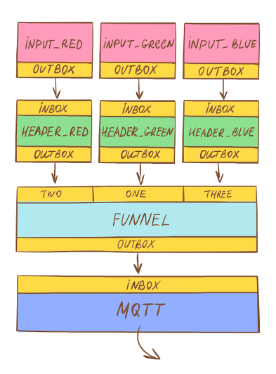

Anything to MQTT
################
:date: 2013-11-08 23:00
:author: smetj
:category: engineering
:tags: wishbone, mqtt, python
:slug: anything-to-mqtt
:draft: true

In this blog post I would like to demonstrate the how easy it is setup a
Wishbone server which allows you to send data from bash to a MQTT broker.

xxend_summaryxx

To install Wishbone you can follow the instructions found in the project
`documentation`_.

Our setup
---------

Have a server up and running with following properties:

- Listens on 3 different named pipes.
- Each named pipe has a certain routing key associated with it.
- Data submitted into the named pipe is routed to a MQTT broker using the
  routing key associated with the named pipe.

The following bootstrap file starts a server with those properties:

.. code-block:: identifier
  :linenos: table

    ---
    modules:
        input_red:
            module: wishbone.input.namedpipe
            arguments:
                path: /tmp/wishbone_red

        input_green:
            module: wishbone.input.namedpipe
            arguments:
                path: /tmp/wishbone_green

        input_blue:
            module: wishbone.input.namedpipe
            arguments:
                path: /tmp/wishbone_blue

        header_red:
            module: wishbone.builtin.function.header
            arguments:
                key: mqtt
                header:
                    topic: color/red

        header_green:
            module: wishbone.builtin.function.header
            arguments:
                key: mqtt
                header:
                    topic: color/green

        header_blue:
            module: wishbone.builtin.function.header
            arguments:
                key: mqtt
                header:
                    topic: color/blue

        funnel:
            module: wishbone.builtin.flow.funnel

        mqtt:
            module: wishbone.output.mqtt
            arguments:
                host: rabbitmq

    routingtable:

        - input_red.outbox        -> header_red.inbox
        - header_red.outbox       -> funnel.one

        - input_green.outbox      -> header_green.inbox
        - header_green.outbox     -> funnel.two

        - input_blue.outbox       -> header_blue.inbox
        - header_blue.outbox      -> funnel.three

        - funnel.outbox           -> mqtt.inbox
    ...

Breakdown
~~~~~~~~~

Let's break down the different by looking first at the *modules* section of
this bootstrap file:

The named pipes are created by initializing 3 instances of the
*wishbone.input.namedpipe* module (line 4, 9, 14).  Each instance is assigned
a name: input_red, input_green and input_blue respectively (line 3, 8, 13).
The only argument defined for these instances is the path of the named pipe
(line 6, 11, 16)

For each event submitted to the named pipe, we have to add the routing key to
the header of the event.  This is required at a later stage when the event
enters the *mqtt* module. 3 instances of the header module are initiated named
header_red, header_green, header_blue respectively (line 18, 25, 32).
Depending on through which header module instance an event travels the
information is stored under a key called *mqtt* (line 21, 28, 35).  Each of
these values contain a one element dictionary with the topic name (line 23,
30, 37) using the format the *mqtt* module expects.

In Wishbone you cannot connect multiple queues to 1 queue.  This is by design.
Queues always have a "one to one" relationship.  Since all data submitted to
the 3 named pipes has to go to 1 MQTT, we could in theory have 3 dedicated
mqtt module instances but that would be a waste.  Therefor we initialize the
*funnel* module.  The *funnel* module allows multiple input queues and merges
those input queues into its output queue, which allows us to only having to
define 1 output module.

Finally we have the MQTT output module which is initialized using the name
*mqtt* (line 42).  The *mqtt* submits incoming events towards an MQTT server.
The only argument we require to initialize the module is the hostname or
address of the server (line 45).  The mqtt output module expects for each
incoming event some data in the header of the event, so it knows which routing
key to use when submitting the event.

The routing table
~~~~~~~~~~~~~~~~~

The routing table (line 47) defines which queues are connected towards each
other which basically defines the flow of events throughout the different
modules.  If we would graphically represent the defines routing table it would
look like this:

|diagram|

Each *named pipe* module instance is connected to its dedicated *header*
module instance.  Each *header* module instance is connected to the *funnel*
module instance.  The names of the incoming queues of the funnel can be chosen
freely (line 50, 53, 56).  The moment a connection is made, the queue is
automatically created.

The output of the *funnel* module instance is then connected to the *mqtt*
module instance, which submits the incoming events to the outside world (line
58).

Running the setup
-----------------

Save the above bootstrap to a file.  The start the Wishbone setup in the
foreground using the bootstrap file by executing:

::

    $ wishbone debug --config anything_to_mqtt.yaml

From CLI we can now submit data into the MQTT server by writing to one of the
named pipes:

::

    $  echo "santa came home this year" > /tmp/wishbone_red

Final thoughts
--------------

While this Wishbone setup as such does not have much practical use, I hope to
have demonstrated its flexibility and what kind of solutions can be built with
it.  More input (and other) modules are available on `Github`_ offering more
combinations and possibilities which might suit your specific needs.

.. _documentation: http://wishbone.readthedocs.org/en/latest/installation.html
.. _Github: https://github.com/smetj/wishboneModules
