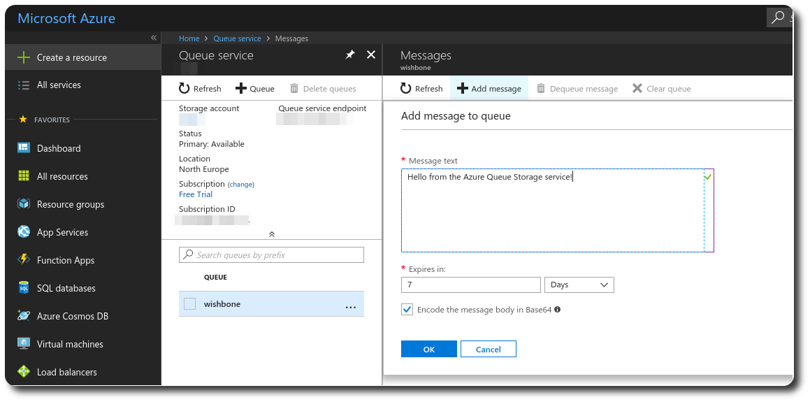

Azure Queue Storage input module
################################
:date: 2018-03-18 15:00
:author: smetj
:category: automation
:tags: wishbone, release, module, azure
:slug: azure_queue_storage_input_module

.. role:: text(code)
   :language: text

__start_summary__

Microsoft's `Azure Queue Storage`_ service provides cloud messaging between
application components. Queue storage delivers asynchronous messaging for
communication between application components, whether they are running in the
cloud, on the desktop, on an on-premises server, or on a mobile device. Queue
storage also supports managing asynchronous tasks and building process work
flows.

In this article we will go through a "Hello world" example demonstrating
Wishbone and the newly released :text:`wishbone-input-azure_queue_storage`
module to consume messages from the Azure Queue Storage service and print them
to STDOUT.

__end_summary__

----

Goal
----

This article demonstrates how to consume messages from the `Azure Queue
Storage` service using Wishbone and the
`wishbone_contrib.module.input.azure_queue_storage`_ module. The consumed
messages will be simply printed to STDOUT.

Boostrap file
-------------

Consider the following bootstrap file:

.. code-block:: YAML

    protocols:
      json:
        protocol: wishbone.protocol.decode.json

    modules:
      input:
        module: wishbone_contrib.module.input.azure-queue-storage
        arguments:
          account_name: ABC
          account_key: XYZ
          auto_message_delete: True

      output:
        module: wishbone.module.output.stdout
        arguments:
          selection: null

    routingtable:
      - input.outbox -> output.inbox

You will have to make sure you complete the bootstrap file with the correct
values for :text:`account_name` and :text:`account_key`.

Boostrapping the server
-----------------------

We will use the Docker container to bootstrap our server:

.. code-block:: YAML

    $ docker run -t -i --privileged -v $(pwd)/bootstrap.yaml:/bootstrap.yaml \
        docker.io/smetj/wishbone-input-azure_queue_storage:latest start --config /bootstrap.yaml
    Instance started in foreground with pid 1
    2018-03-18T14:09:19.6830+00:00 wishbone[1] informational input: Connected to Azure Queue Service https://xxxxxx.queue.core.windows.net/wishbone

Sending a message
-----------------

Using the Azure console we can manually send a message.

As you can see at this point the :text:`wishbone` has already been created.

|azure_1|

Once the message is send, we we should see following output on the server
side:

.. code-block:: text

    {'cloned': False, 'bulk': False, 'data': 'Hello from the Azure Queue Storage service!', 'errors': {}, 'tags': [], 'timestamp': 1521382660.3213623, 'tmp': {'input': {'id': '79afcb44-b546-4e63-afc3-8190e5c7ae77', 'insertion_time': '1521382660', 'expiration_time': '1521987460', 'dequeue_count': 1, 'pop_receipt': 'AgAAAAMAAAAAAAAADDPH4MO+0wE=', 'time_next_visible': '1521382662'}, 'output': {}}, 'ttl': 253, 'uuid_previous': [], 'uuid': 'c8c2d273-6063-4b6d-9c90-6d603169a2fd'}

The message has been permanently deleted from the queue because of the
:text:`auto_message_delete` option. If we want to delete the message from the
queue after it has been processed successfully (printing to STDOUT in this
demo) we can slightly change our setup.

Delete message after successful processing
------------------------------------------

For this we will make use of Wishbone module's default :text:`_success` queue
and the :text:`delete` queue of :text:`wishbone_contrib.module.input.azure-queue-storage`.

Messages ending up in the :text:`delete` queue will be processed by the module
to be deleted from the Azure queue.

.. code-block:: YAML

    modules:
      input:
        module: wishbone_contrib.module.input.azure-queue-storage
        arguments:
          account_name: ABC
          account_key: XYZ
          visibility_timeout: 2
          auto_message_delete: False

      output:
        module: wishbone.module.output.stdout
        arguments:
          selection: null

    routingtable:
      - input.outbox     -> output.inbox
      - output._success -> input.delete

For this setup to work, we set :text:`visibility_timeout` to 2 seconds to
indicate the message should reappear for other consumers to consume when our
setup fails to process the said message properly.

Conslusion
----------

While this initial release doesn't support yet all features the Azure queue
storage service has to offer, it allows us to bootstrap a server and consume
messages in no-time!

Obviously, you will need to have the possibility to submit messages too, but
that will be a new module and the next small project I'll be working on.

If you have any questions, remarks or suggestions please feel free getting in
touch.

.. _Azure Queue Storage: https://azure.microsoft.com/en-us/services/storage/queues/
.. _wishbone_contrib.module.input.azure_queue_storage: https://github.com/wishbone-modules/wishbone-input-azure_queue_storage
.. _Wishbone: http://wishbone.readthedocs.io

