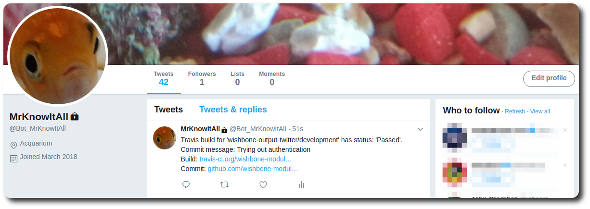
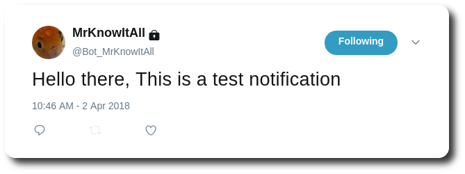

Building a notification system: Part 1
######################################
:date: 2018-04-02 12:00
:author: smetj
:category: automation
:tags: wishbone, notifications
:slug: building_a_notification_system_part_1

.. role:: text(code)
   :language: text

|twitter_banner|

__start_summary__

I would like to have a notification system on my phone and laptop to receive
messages from various service events in order to keep track of events which
require my attention.

So why not use `Twitter`_ and `Wishbone`_ to create a Twitter bot which does
exactly what I need?

__end_summary__

----

Abstract
--------

In this series of articles we will build a Twitter notification system for
webhook events coming from various services such as Travis, Github and Docker
hub, etc ...

This first article covers the setup and configuration of `Wishbone`_ so we
have a foundation which we will extend in the follow up articles.

The examples shown are merely a guideline so the reader probably should adapt
the setup to their own taste and requirements.

Prerequisites
-------------

- Some basic knowledge of :text:`Docker` would be useful since all examples
  are based on that.  Whilst that (for me) simplifies running Wishbone, it
  perhaps might not be what you prefer.  If you want to, you can
  `install Wishbone`_   and its modules directly in your OS without much effort.

- Have a Twitter account to broadcast the messages.  You can either create a
  (private) dedicated bot account or tweet from your own name.   Whatever works
  best in your case.

- Under your newly created bot account, create a Twitter `application` in
  https://apps.twitter.com/ and obtain the :text:`Consumer Key`,
  :text:`Consumer Secret`, :text:`Access Token` and
  :text:`Access Token Secret` which are required to allow *wishbone* to
  authenticate to the Twitter API and send tweets.

- Having read https://smetj.net/an_introduction_to_the_wishbone-input-httpserver_module.html
  could be useful since we will be using this module extensively.

Wishbone Setup
--------------

We will use the latest version of following components:

- https://github.com/smetj/wishbone
- https://github.com/wishbone-modules/wishbone-input-httpserver
- https://github.com/wishbone-modules/wishbone-output-twitter

The following Docker container image contains all the required modules:

[gist:id=cdca606494dd0160ddad396b4e95d5d1,file=Dockerfile]

Or you can just use :text:`smetj/twitter_notifier:latest` directly.

Running a first bot
-------------------

The following Wishbone bootstrap file will start the base bot server on which
we can start to add the services we wish to implement:

[gist:id=cdca606494dd0160ddad396b4e95d5d1,file=bootstrap.yaml]

Obviously you will have to complete the Twitter configuration using the
correct values.

Running the server
++++++++++++++++++

.. code-block:: text

    $ docker run -t -i --rm --privileged -p 19283:19283 -v $(pwd)/bootstrap.yaml:/bootstrap.yaml \
        smetj/twitter_notifier:latest start --config /bootstrap.yaml
    Instance started in foreground with pid 31370
    2018-04-02T12:20:37.6923+00:00 wishbone[31370] informational incoming_webhooks: Webserver bound to 0.0.0.0:19283. Listening for incoming requests

Sending a message
+++++++++++++++++

.. code-block:: text

    $ echo '{"payload":"This is a test notification"}'|curl -XPUT -u test_user -d @- http://localhost:19283/test
    Enter host password for user 'test_user':
    OK b80825d4-dbe0-4bcc-9c5d-626dddc06107

Result
++++++

|twitter_tweet|

Finishing thoughts
-------------------

This will form the base for further integrations.  The next step for you is to
deploy the Wishbone server so it can be reached from the internet. How to do
that depends on your infrastructure and is beyond the scope of this article.

If you do so, make sure you

- :text:`enable SSL`
- enforce :text:`authentication` on your endpoints.

Conclusion
----------

We have covered how to setup a Wishbone server which accepts JSON webhook data
and creates a Tweet build out of the submitted payload.

In the next article we will cover how to accept `Travis CI`_ webhooks and
create the notifications we like to see.

The notification system described in this article will be referred to as the
*base notification system* in the follow-up articles.

If you have any questions, suggestions, recommendations or any feedback feel
free to get in touch.

.. _Twitter: https://twitter.com
.. _Wishbone: http://wishbone.readthedocs.io
.. _install Wishbone: http://wishbone.readthedocs.io/en/master/installation/index.html
.. _Travis CI: https://travis-ci.org

