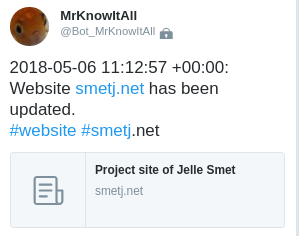
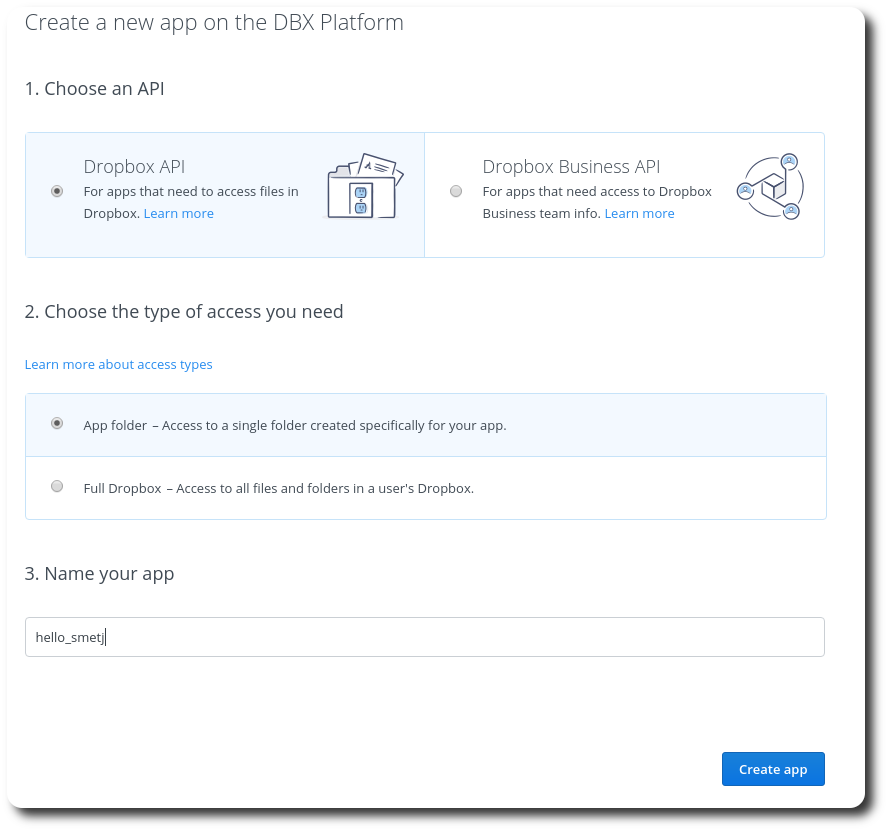
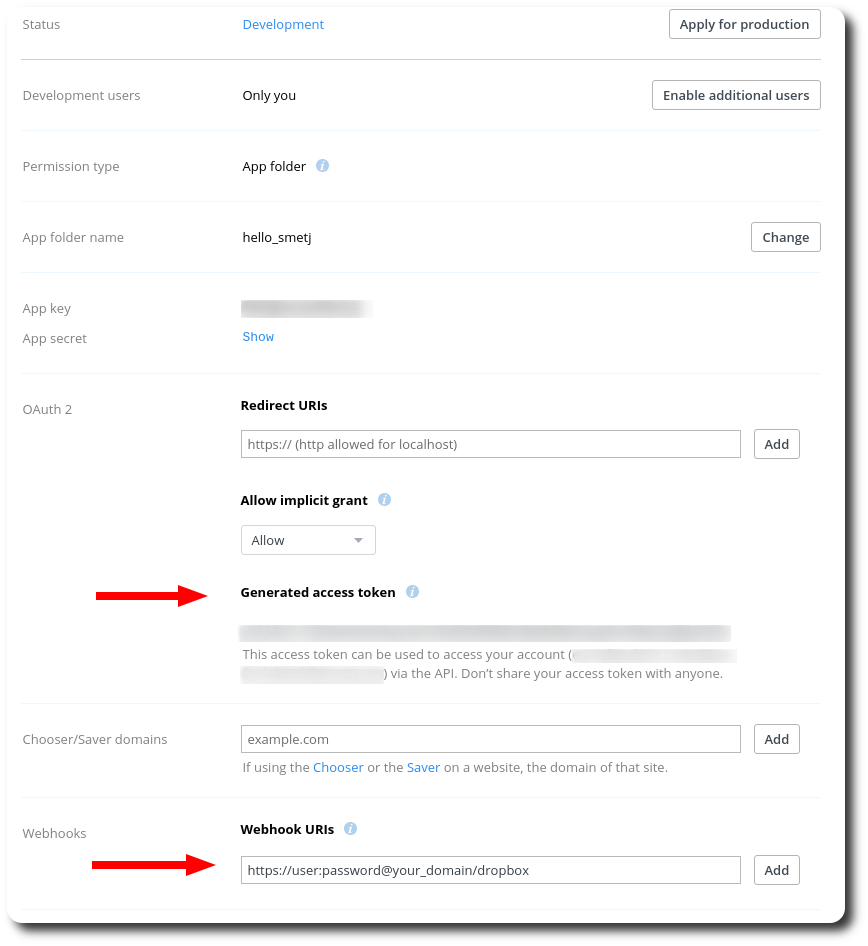

Building a notification system part 3: Dropbox
##############################################
:date: 2018-04-14 18:00
:author: smetj
:category: automation
:tags: wishbone, notifications, automation, integration
:slug: building_a_notification_system_part_3_dropbox

.. role:: highlight(code)
   :language: text

..start_summary..

Dropbox is a file hosting service operated by American company Dropbox, Inc.,
headquartered in San Francisco, California, that offers cloud storage, file
synchronization, personal cloud, and client software.

In this article we will cover how to integrate Dropbox webhooks into the
Wishbone based notification system we have built and configured in the first
article of this series.

..end_summary..

----

Abstract
--------

Dropbox can be configured to trigger webhooks the moment the content of a
particular directory changes. In this article we will cover how to register
and configure a Dropbox application to send webhooks to Wishbone.

We will be extending the `base notification server`_ to receive the Dropbox
webhooks and trigger a notification. We will also configure additional
instrumentation to Wishbone to make sure we don't send excessive, duplicate
notifications when changing many files at once.

Prerequisites
-------------

- Have the *base notification system* up and running as explained in
  the `first article of this series`_.

- Your Wishbone notification system is available over the internet and should
  have :highlight:`SSL` and :highlight:`authentication` enabled.  You can either do *ssl-
  offloading* with some reverse proxy such as `traefik`_ or let Wishbone itself
  handle SSL.

- Familiarize yourself with the :highlight:`wishbone.module.flow.queueselect` module.

- Have a Dropbox account

Configure Wishbone
------------------

Consider following bootstrap file:

[gist:id=b299d0e43b88c9ed964cad3a9dc70c5a,file=bootstrap.yaml]

Adding the /dropbox endpoint
++++++++++++++++++++++++++++

.. code-block:: yaml

    "^dropbox$":
      users:
        - dropbox
      tokens: []
      response: "{{tmp.incoming_webhooks.params.challenge}}"
      urldecoded_field: null

Extract from Dropbox webhook `docs`_:

    The verification request will be a GET request with a challenge parameter,
    which is a random string (e.g. https://www.example.com/dropbox-
    webhook?challenge=abc123). Your app should echo back the challenge parameter
    as the body of its response. Once Dropbox receives a valid response, the
    endpoint is considered to be a valid webhook, and Dropbox will begin sending
    notifications of file changes. Your app has up to ten seconds to respond to
    the verification request. Dropbox will not perform automatic retry for
    verification requests.

The configuration for the :highlight:`/dropbox` is pretty basic and the same
as what was done in the previous articles except for the response. Any
parameters passed to Wishbone are stored the
:highlight:`tmp.incoming_webhooks.params` hence we can refer to it when
defining the reply  in order to satisfy the initial validation step.  Once the
validation has passed, it serves no further purpose so you can change it again
to some other value.

Composing the message to tweet
-------------------------------

The incoming Dropbox webhook payload is a bit disappointing in terms of content:

.. code-block:: json

    {
        "delta": {
            "users": [
                99999999
            ]
        },
        "list_folder": {
            "accounts": [
                "dbid:abcdefghijklmnopqrstuvwxyz-123455"
            ]
        }
    }

From the Dropbox docs:

    Note that only the user IDs and accounts with file changes are provided. Your
    app is expected to call /files/list_folder/continue to find out what files
    changed using the latest cursor your app previously stored for that account.
    If your app is still using v1, you can call /delta

So this won't tell us much *what* has changed but it least we know something
has.  In a follow up article we will cover how to use this payload to extract
more detailed information from the Dropbox API to construct an even more
informative message. [ref]Ping me if you you're interested in a follow up article.[/ref]

To compose the content of the tweet we need to be a bit creative because of
the fact Twitter refuses to send duplicate messages, hence we need to make our
message content change for each notification:

To achieve this, we add a timestamp to each notification:

.. code-block:: yaml

    payload:
      module: wishbone.module.flow.queueselect
      arguments:
        templates:
          - name: "Website smetj.net updated"
            queue: "{{ 'outbox' if tmp.incoming_webhooks.env.path_info == '/dropbox' }}"
            payload: >
              {{strftime(epoch(), "YYYY-MM-DD HH:mm:ss ZZ")}}: Website https://smetj.net has been updated.
              #website #smetj.net

Limit notifications
-------------------

If you change many files at once, Dropbox can execute more than one webhook
call resulting into multiple notifications being sent.  This we can prevent by
using the `wishbone.module.flow.count`_ which can limit the number of events
passing through within a certain time window. [ref] I'm planning to make this module a bit more flexible for matching payloads.  Currently, only a literal match works which might be a bit inflexible. [/ref]

.. code-block:: yaml

    uniq:
        module: wishbone.module.flow.count
        arguments:
          conditions:
            data:
              value:
                list_folder:
                  accounts:
                    - "dbid:abcdefghijklmnopqrstuvwxyz-123455"
                delta:
                  users:
                    - 99999999
              occurrence: 2
              window: 60
              action: drop

This configuration defines we inspect on the contents of the :highlight:`data` field.

Configuring Dropbox
-------------------

Step 1
++++++

Go visit https://www.dropbox.com/developers/apps and click on the
:highlight:`Create app` button.

Select access type :highlight:`App folder` and choose a unique name in step 3 then
click the :highlight:`create app` button.

|dropbox_1|

Step 2
++++++

Click on the :highlight:`Generate access token` button. At this stage Dropbox
will have automatically created an :highlight:`Apps/hello_smetj` folder.

Then add your webhook address on which Wishbone is listening including the
defined username and password in the URI:

As explained previously, Dropbox will first do a verification request. Once
passed you can change the response for the :highlight:`/dropbox` to something
which make more sense.

|dropbox_2|

Conslusion
----------

In this article we have covered how to configure and combine Wishbone and
Dropbox webhooks to send custom notifications when the content of a directory
has changed.

Feedback welcome.

Footnotes
---------

.. _base notification server: /building_a_notification_system_part_1.html
.. _first article of this series: /building_a_notification_system_part_1.html
.. _link: https://smetj.net
.. _traefik: https://traefik.io/
.. _docs: https://www.dropbox.com/developers/reference/webhooks#documentation
.. _wishbone.module.flow.count: http://wishbone.readthedocs.io/en/latest/classes/flow_modules.html#wishbone.module.count.Count

