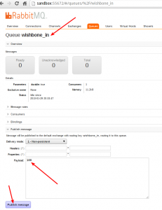
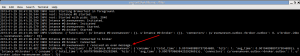

Consume, process and produce data with Wishbone and RabbitMQ
############################################################
:date: 2013-01-29 22:07
:author: smetj
:category: engineering
:tags: amqp, python, rabbitmq, wishbone
:slug: consume-process-and-produce-data-with-wishbone-and-rabbitmq

When I first came in touch with the `messaging`_ concept it was some
kind of a revelation.  Ever since many solutions I work on involve
message brokers one way or the other.  Because of that, a design pattern
occurred hence the need for a Python framework allowing me to easily
write solutions to interact with messaging based setups.  `Wishbone`_ is
a Python framework which simplifies writing coroutine event pipelines.
 Wishbone is a framework in which you can load and connect multiple
modules in order to come to a tailored solution.
Although Wishbone's scope is larger than that, I would like to
demonstrate how easy it is to write a daemon which consumes and
processes messages from *`RabbitMQ`_*.

Preparation
===========

If you want to be able to execute the examples throughout this article
you should have a RabbitMQ (with the `management plugin`_) instance up
and running and install the Wishbone library.  There is some great
RabbitMQ documentation out there explaining you how to install a basic
stand-alone instance.

Installing Wishbone
-------------------

Installing the Wishbone library can be done through `Cheeseshop`_ or
from `GitHub`_:

::

    [vagrant@wishbone ~]$ sudo easy_install wishbone

*On centos I required: gcc-c++ snappy-devel python-dev Cython
libev-devel*

RabbitMQ
--------

Within RabbitMQ let's create 2 queues we're going to use in this
article

Visit the web based RabbitMQ management application listening on port
55672 and create 3 queues:

  *wishbone_in, wishbone_even, wishbone_uneven*

RabbitMQ Management Interface

  * You can achieve the same by using the rabbitmqadmin tool.

Creating a Wishbone Setup
=========================

Now we have our test environment up and running lets create our first
daemon.

Challenge
---------

Create a daemon which consumes messages from the wishbone\_in queue.
 Each submitted message contains an integer.  If this integer is even we
submit the message to the *wishbone\_uneven* queue while the messages
with even values should end up in the *wishbone\_even* queue.

Make a server
-------------

Wishbone is made to easily write daemons.  It comes with the required
functionality to minimize all the work which goes along with that:

::

    #!/usr/bin/env python
    from wishbone.server import BootStrap
    if __name__ == '__main__':
        BootStrap(name="BrokerTest",
            description="This setup is just an example.",
            version="0.1",
            author="Your name"
        )

Save the content to a file called "brokertest" and make it executable.
When executing you will get:

|cli1|

And that's it! You have a WishBone server available.  Granted it doesn't
do anything at all at this stage but that's what we'll cover in the next
paragraph.

Modules
-------

Wishbone has the concept of `modules`_.  A module is a piece of code
which is plugged into the Wishbone framework which takes data in and
pushes data out.  Our WishBone server needs to know which modules to
load, how to initialize them and how to tie them together into a
workflow.  This is done using a `bootstrap`_ file which is loaded using
the --config option.  A bootstrap file is mandatory, otherwise your
Wishbone application is just an empty shell.

Use an existing module: Broker
~~~~~~~~~~~~~~~~~~~~~~~~~~~~~~

Wishbone comes with a bunch of already available modules. One of them
is the `Broker`_ module which allows you to get RabbitMQ messages in
and out of Wishbone.

We are going to initialize the broker module with following
parameters:

::

    ... snip ...
    "broker":{
             "module":"wishbone.iomodules.broker",
             "class":"Broker",
             "variables":{
                "host":"sandbox",
                "vhost":"/",
                "username":"guest",
                "password":"guest",
                "consume_queue":"wishbone_in",
                "prefetch_count":200,
                "no_ack":false,
                "delivery_mode":2
             }
    }
    ... snip ...

Most of the parameters speak for themselves.  Have a look at the module
documentation page for details.

Create a new module: EvenUneven
~~~~~~~~~~~~~~~~~~~~~~~~~~~~~~~

A module to determine whether the number is even/uneven is of course
not available out of the box.  We're going to create this one ourselves.

WishBone includes a  `skeleton module`_ which can be used as a
standard to build your new module on.

The WishBone framework really requires a Python module to load.  That
means you should create a directory called "*evenuneven*\ " and paste
the below code into a file called  *evenuneven/\_\_init\_\_.py*

Wishbone modules are actually regular Python modules.  You should really
try to follow the proper guidelines on how to build, package and install
Python modules.

::

    #!/usr/bin/env python

    from wishbone.toolkit import PrimitiveActor

    class EvenUneven(PrimitiveActor):
        '''**An example Wishbone module which verifies if the data submitted
        is even or uneven.**''

        Parameters:

            - name (str):    The instance name when initiated.

        Queues:

            - inbox:    Incoming events.
            - outbox:   Outgoing events.
        '''

        def __init__(self, name):
            PrimitiveActor.__init__(self, name)

        def consume(self,doc):
            if int(doc["data"])%2 == 0:
                self.logging.info('I received an even message.')

                doc["header"]["broker_exchange"]=''
                doc["header"]["broker_key"]='wishbone_even'
            else:
                self.logging.info('I received an uneven message.')

                doc["header"]["broker_exchange"]=''
                doc["header"]["broker_key"]='wishbone_uneven'

            self.putData(doc)

        def shutdown(self):
            self.logging.info('Shutdown')

Once initiated, this class will run as a (green)thread within the
Wishbone framework. The initialized instance of the class will
automatically "inherit" an *inbox* and *outbox* queue. All messages
arriving to the *inbox* queue will automatically be "consumed" by the
*consume()* function. The framework will do that for you, so you don't
need to worry about that.  Once done processing the data it can be place
into the class's outbox queue, which is done using the *putData()*
function (line 34).

Each document flowing through the framework has following format:

  {"header":{}, "data":object }

We're extending the "header" part of the document with 2 variables:
"*broker_exchange*" and "*broker_key*". When this message will
arrive back into the broker module it will know to which exchange and
queue to submit the document to.

This simple module does not require any variables when initialized, so
the bootstrap file section to initialize this module would look like:

::

    ... snip ...
    "evenuneven":{
             "module":"evenuneven",
             "class":"EvenUneven",
             "variables":{
             }
    }
    ... snip ...

 

Bootstrap file
--------------

The bootstrap file (which is defined through the  --config option) tells
the WishBone server which modules to load and how the data flows through
the modules.

The complete bootstrap for our example setup would look like this:

::

    {
       "system":{
          "metrics":true,
          "metrics_interval":10,
          "metrics_dst":"logging"
       },
       "bootstrap":{
          "broker":{
             "module":"wishbone.iomodules.broker",
             "class":"Broker",
             "variables":{
                "host":"sandbox",
                "vhost":"/",
                "username":"guest",
                "password":"guest",
                "consume_queue":"wishbone_in",
                "prefetch_count":200,
                "no_ack":true,
                "delivery_mode":2
             }
          },
          "evenuneven":{
             "module":"evenuneven",
             "class":"EvenUneven",
             "variables":{
             }
          }
       },
       "routingtable":{
          "broker.inbox":[
             "evenuneven.inbox"
          ],
          "evenuneven.outbox":[
             "broker.outbox"
          ]
       }
    }

The *system* section of the bootstrap file allows you to control
Wishbone framework specific items.  Currently only options related to
metrics are available.

The \ *bootstrap* section allows you to initialize the modules and
assign them to an instance name, which is in this case "*broker*\ " and
"*evenuneven*\ ".

The \ *routingtable* section allows you to connect the instance queues
to each other  in order to determine the application's dataflow.
 Normally one connects the *outbox* queue to the *inbox* queue.  But in
case of an IOmodule (which the broker module is) the data coming from
the outside world arrives \ *inbox* queue and the data going to the
outside world should go to the \ *outbox* queue.

Start your server and test.
---------------------------

To start your server and prevent it to fork into the background you
should do something like:

::

    [vagrant@wishbone files]$ ./brokertest debug --config brokertest.json --loglevel debug

You should get a similar output to following screenshot:

|cli2|

 

Now submit a message containing the number "*100*\ " through the
RabbitMQ broker management interface into the *wishbone\_in* queue.

|rabbit2|

 

If all went well your Wishbone application should create a log entry
about the data you just submitted:

|cli3|

 

Have a look to the *wishbone\_even* queue your message should be arrived
there.

 

Conclusion
==========

Although the the example as such isn't that spectacular and it only
scratches the surface of the possibilities it hopefully shows you how
easy it is to create a  Python based server which interacts with
RabbitMQ.  The Wishbone library also includes other IO modules.  Have a
look at my `experiments repository`_ for more examples of Wishbone
setups.

.. _messaging: http://en.wikipedia.org/wiki/Advanced_Message_Queuing_Protocol
.. _Wishbone: https://github.com/smetj/wishbone
.. _RabbitMQ: http://www.rabbitmq.com/
.. _management plugin: http://www.rabbitmq.com/management.html
.. _Cheeseshop: http://pypi.python.org/pypi/wishbone/0.2.2
.. _GitHub: https://github.com/smetj/wishbone
.. _modules: http://smetj.github.com/wishbone/docs/build/html/introduction.html#wishbone-modules
.. _bootstrap: http://smetj.github.com/wishbone/docs/build/html/bootstrapfiles.html
.. _Broker: http://smetj.github.com/wishbone/docs/build/html/iomodules.html#wishbone.iomodules.broker.Broker
.. _skeleton module: https://github.com/smetj/wishbone/blob/master/wishbone/modules/skeleton.py
.. _experiments repository: https://github.com/smetj/experiments/tree/master/python/wishbone

