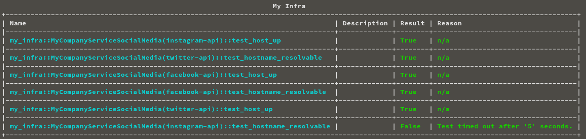
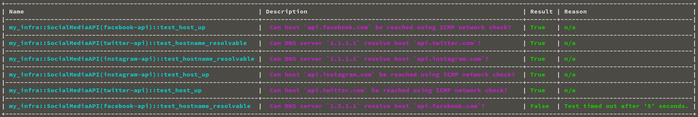

Title: Diagnostics-TK Part 2: An incident starts with answers
Date: 2023-05-14 12:00
Modified: 2023-05-14 12:00
category: technology
Tags: observability, sre, diagnostics-tk
Slug: diagnostics-tk-part-2-an-incident-starts-with-answers
Authors: Jelle Smet


# Introduction

Whenever an outage occurs and the incident handling process begins, the first
responders and incident commander should be able to start their work as
well-informed as possible. Having clarity about the situation is key to
keeping in control of the incident from the get-go. Clarity enables good
decision making.

A [previous
article](/diagnostics-tk-part-1-running-diagnostic-checks-during-incidents.html)
detailed how to use [Diagnostics-TK](https://github.com/smetj/diagnostics-tk)
to define a list of re-usable diagnostic tests. In this article we will
explore how to present these tests as questions and answers for everyone to
understand.

# Outputs

By default, Diagnostics-TK logs the results from each test it executes:

```text
2023-05-07 12:09:39,690 - INFO - MyCompanyService::MyCompanyServiceTwitter(twitter-api)::test_hostname_resolvable - OK
2023-05-07 12:09:39,690 - INFO - MyCompanyService::MyCompanyServiceInstagram(instagram-api)::test_hostname_resolvable - OK
2023-05-07 12:09:39,706 - INFO - MyCompanyService::MyCompanyServiceInstagram(instagram-api)::test_host_up - OK
2023-05-07 12:09:40,512 - INFO - MyCompanyService::MyCompanyServiceTwitter(twitter-api)::test_host_up - OK
```

Whilst this might be informative for the people who wrote the tests it might
not be for everybody else involved during or after the incident. How can we
improve that?

*Diagnostics-TK* has the concept of *outputs*. An *output* is nothing more
than a class which accepts the results of each executed test for further
processing. An example of such a class is
[ConsoleTable](https://github.com/smetj/diagnostics-tk/blob/main/diagnostics_tk/output/console_table.py)
which comes included by default. The `ConsoleTable` *output* displays the test
results in a table like structure.

We can extend the example of the previous article to include the
*ConsoleTable* output as such:

```python
#!/usr/bin/env python
# -*- coding: utf-8 -*-

from diagnostics_tk import DiagnosticsRunner
from diagnostics_tk.tools import exec_cli
from diagnostics_tk.output import ConsoleTable

class MyCompanyServiceSocialMedia:
    def __init__(self, hostname):
        self.hostname = hostname

    def test_host_up(self):
        """ """
        result, reason = exec_cli(
            f"nmap -sP {self.hostname}",
            exit_code=0,
            stdout_pattern="Host is up",
        )
        assert result, reason

    def test_hostname_resolvable(self):
        """ """
        result, reason = exec_cli(
            f"dig {self.hostname} @1.1.1.1",
            stdout_pattern="status: NOERROR",
            timeout=5,
        )
        assert result, reason


def main():
    with DiagnosticsRunner(name="my_infra", workers=5) as runner:
        runner.register(
            "twitter-api",
            MyCompanyServiceSocialMedia(hostname="api.twitter.com"),
        )
        runner.register(
            "instagram-api",
            MyCompanyServiceSocialMedia(hostname="api.instagram.com"),
        )
        runner.register(
            "facebook-api",
            MyCompanyServiceSocialMedia(hostname="api.facebook.com"),
        )

        runner.register("table", ConsoleTable(title="My Infra"))
```

The example shows we can register the `ConsoleTable` class instance just like
a test class[^1].

This yields following table overview:



which is already a bit more pleasant to look at but not much more informative
than before.

# Docstrings

As seen in the above screenshot, the `description` for each entry is still
empty. We can provide content by defining a
[docstring](https://peps.python.org/pep-0257/) for each `test_` method
respectively. The defined value is treated as a template using Python's
[`str.format()`](https://docs.python.org/3/library/stdtypes.html#str.format)
which *Diagnostic-TK* attempts to render using any [class
variables](https://docs.python.org/3/tutorial/classes.html#class-and-instance-variables)
it can find.

What style of description works best depends on the specific use-case and it
is up to the reader to determine. However, when running diagnostic tests
during an outage, we could write what we are testing in the form of a human
readable question. Consider following updated example:

```python
#!/usr/bin/env python
# -*- coding: utf-8 -*-

from diagnostics_tk import DiagnosticsRunner
from diagnostics_tk.output import ConsoleTable
from diagnostics_tk.tools import exec_cli


class SocialMediaAPI:
    def __init__(self, hostname, dns_server):
        self.hostname = hostname
        self.dns_server = dns_server

    def test_host_up(self):
        """
        Can host `{hostname}` be reached using an ICMP ping?
        """
        result, reason = exec_cli(
            f"nmap -sP {self.hostname}",
            exit_code=0,
            stdout_pattern="Host is up",
        )
        assert result, reason

    def test_hostname_resolvable(self):
        """
        Can DNS server `{dns_server}` resolve host `{hostname}`?
        """
        result, reason = exec_cli(
            f"dig {self.hostname} @{self.dns_server}",
            stdout_pattern="status: NOERROR",
            timeout=5,
        )
        assert result, reason


def main():
    with DiagnosticsRunner(name="my_infra", workers=5) as runner:
        runner.register(
            "twitter-api",
            SocialMediaAPI(hostname="api.twitter.com", dns_server="1.1.1.1"),
        )
        runner.register(
            "instagram-api",
            SocialMediaAPI(hostname="api.instagram.com", dns_server="1.1.1.1"),
        )
        runner.register(
            "facebook-api",
            SocialMediaAPI(hostname="api.facebook.com", dns_server="1.5.1.1"),
        )

        runner.register("table", ConsoleTable(title="My Infra"))


if __name__ == "__main__":
    main()
```

This yields following output:

<a href="images/diagnostics-tk-part-2-an-incident-starts-with-answers-3.png"></a>

# Final Notes

In the A [previous
article](/diagnostics-tk-part-1-running-diagnostic-checks-during-incidents.html)
we have motivated to start defining the diagnostic checks we execute manually
during an incident as part of a Diagnostics-TK based setup. Turning manually
executed, ad-hoc tests into a set of re-usable tests helps us to save time
during incident. By encapsulating past incident experience in a programmatic
way, we can build up a library of checks which validate the usual suspects
which could cause or already have caused an outage.

The names of diagnostic checks could become quite cryptic or need again domain
specific knowledge to understand their meaning and what they represent. In
this article we have covered how *Diagnostics-TK* uses docstrings and how we
can use those to our advantage by presenting a validation as a **question and
answer** for everyone to understand involved during or after the incident.

Keep in mind that the above examples, although useful, are simple in nature
and are already easy to understand for for many familiar with the topic. The
sort of checks which are required to validate all the things required for your
service to run, pass into the realm of the cryptic pretty quickly.

In a next article of the [Diagnostics-TK series](/tag/diagnostics-tk.html) we
will focus how to create an `output` class and send the check results to
Slack.

If you have any feedback or suggestions, don't hesitate to get in touch on
[Twitter](twitter.com/smetj).

# Footnotes

[^1]: *Diagnostics-TK* knows a class is an *output class* if it bases the
[Output](https://github.com/smetj/diagnostics-tk/blob/main/diagnostics_tk/output/__init__.py#L29)
class.
