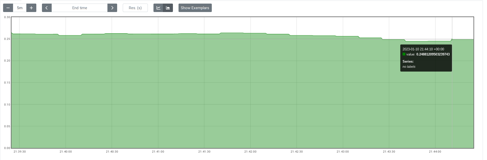
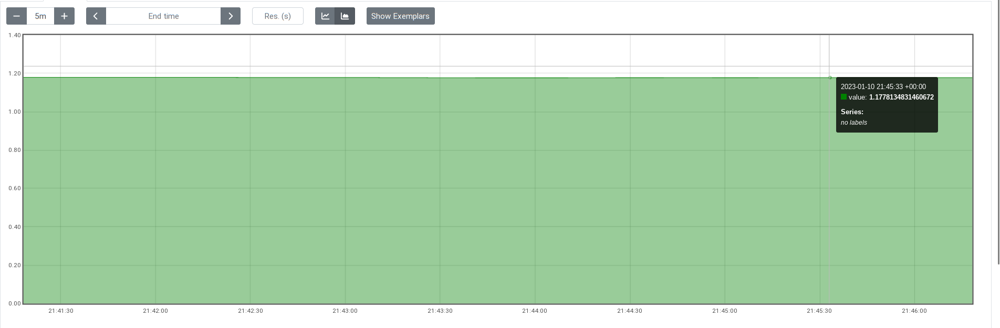

Title: Exploring Prometheus metrics using Xpectd.
Date: 2023-02-07 21:00
Author: smetj
Category: technology
Tags: observability
Slug: exploring_prometheus_metrics_using_xpectd


When exploring and experimenting with Prometheus its often hard to tell with
certainty whether the outcomes of your queries are actually correct. Probably
a reason might be that it's not always straightforward to have a predictable
set of metrics at hand. Such a data set would at least give a point of
reference to compare the query results to. For example: If the response time
of each request is between 1 and 2 seconds for the last 5 minutes, the average
has to be around 1.5 seconds.

[Xpectd](https://github.com/smetj/xpectd) is a web service which responds to
requests according to a pre-defined [test
plan](https://github.com/smetj/Xpectd/blob/main/test_plan.yml). This test plan
defines some properties of the individual requests such as response times,
return codes and return values.

## Graphing response times with Traefik, Prometheus and Xpectd

[Traefik](https://traefik.io/) is a popular ingress used to expose services
(among other things) in K8s. Because of its role it is also capable of
collecting metrics of the services behind it and have these scraped by
[Prometheus](https://prometheus.io/).

Once Prometheus scrapes the metrics Traefik exposes, histogram metrics such as
`traefik_service_request_duration_seconds_bucket` can graph the response times
of the requests made to Xpectd.

## Validating query results

Consider the following Xpectd configuration:

```yaml
scenarios:
  - endpoint: hello_world
    response:
      status: 200
      payload: Hello world!
      min_time: 0
      max_time: 0.5
    outage:
      schedule: "*/1 * * * *"
      duration: 0
      response:
        - percentage: 100
          status: 200
          payload: (╯°□°）╯︵ ┻━┻
          min_time: 2
          max_time: 3

```
Once deployed, the `/hello_world` endpoint will always respond with a **200**
between **0** and **0.5** seconds (plus some overhead).

Any web client such as Curl, Wget, Ab, Jmeter, etc can be used to generate requests
to  Xpectd in a similar fashion:

```bash
@http http://localhost:80/xpectd/hello_world
Return code: 200  last: 0.2737  min: 0.2737   max: 0.2737   avg: 0.0274   req/s: 5   Output: Hello world!
Return code: 200  last: 0.1280  min: 0.1280   max: 0.2737   avg: 0.0402   req/s: 5   Output: Hello world!
Return code: 200  last: 0.1829  min: 0.1280   max: 0.2737   avg: 0.0585   req/s: 5   Output: Hello world!
Return code: 200  last: 0.3479  min: 0.1280   max: 0.3479   avg: 0.0932   req/s: 6   Output: Hello world!
Return code: 200  last: 0.3675  min: 0.1280   max: 0.3675   avg: 0.1300   req/s: 4   Output: Hello world!
... snip ...
```

### Median

The following query calculates the *median* of the request duration over the
last 5 minutes:

```text
histogram_quantile(0.50, sum(rate(traefik_service_request_duration_seconds_bucket{service="xpectd@docker"}[5m])) by (le))
```
This results into the following graph:

[](images/validating-metrics-1.png)

!!! note "(☞ﾟ∀ﾟ)☞"
    As expected, the results float a little over **0.25** given **min_time** is
    **0** and **max_time** is **0.50**.

### 99th percentile

The following query calculates the *99th percentile* of request duration over
the last 5 minutes:

```text
histogram_quantile(0.99, sum(rate(traefik_service_request_duration_seconds_bucket{service="xpectd@docker"}[5m])) by (le))
```
This results into the following graph:

[](images/validating-metrics-2.png)

!!! note "ಠ_ಠ"
    This graph indicates that **99%** of all requests are below **1.17**.
    Which is starting to become a little bit confusing because the
    **max_time** value of Xpectd is **0.5**. What gives?


## Traefik, histograms and bucket sizes

The reason for these un-intuitive results is because Prometheus
[histograms](https://prometheus.io/docs/practices/histograms/#histograms-and-summaries)
assign each individual response value to the nearest **pre-defined** bucket
and increments a counter for that bucket.[^1]

Traefik comes with a number of default [pre-defined histogram
buckets](https://doc.traefik.io/traefik/observability/metrics/prometheus/#buckets)
which are at the time of writing this article: `[0.1,0.3,1.2,5.0]`.

This means when a request's response time is below or equal to **0.1** the
**0.1** bucket's counter increments including all the parent buckets.[^1]
Prometheus histograms automatically have a **le** bucket which acts as an
*overflow* for all values higher than the biggest bucket.

When the response time is **0.5**, the **1.2** bucket including all parent
buckets increment by **1**. This might perhaps look puzzling at first glance
but it's actually correct since it indicates the request is below **1.2**.

The following query supports that finding:

```text
histogram_quantile(1, sum(rate(traefik_service_request_duration_seconds_bucket{service="xpectd@docker"}[5m])) by (le))
```

!!! note "(☞ﾟ∀ﾟ)☞"
    The value returned by this query is **1.2** indicating that all requests
    are less or equal than **1.2** seconds. That's correct since Xpectd's
    **min_time** is **0** and **max_time** is **0.5** which produces values
    higher than the pre-defined **0.3** bucket effectively incrementing the
    **1.2** bucket by one.

## Final words

When using Prometheus histograms it's important to realize that the choice of
bucket distribution influences the *granularity* of your measurements which
might lead to unexpected results. In the case of Traefik it might be useful to
at least review the defaults and possibly override these with more granular
buckets.

If you have any questions or remarks you can reach out to
[Twitter](https://twitter.com/smetj).


## Footnotes

[^1]: [Histograms buckets are cumulative](https://www.robustperception.io/why-are-prometheus-histograms-cumulative/)
