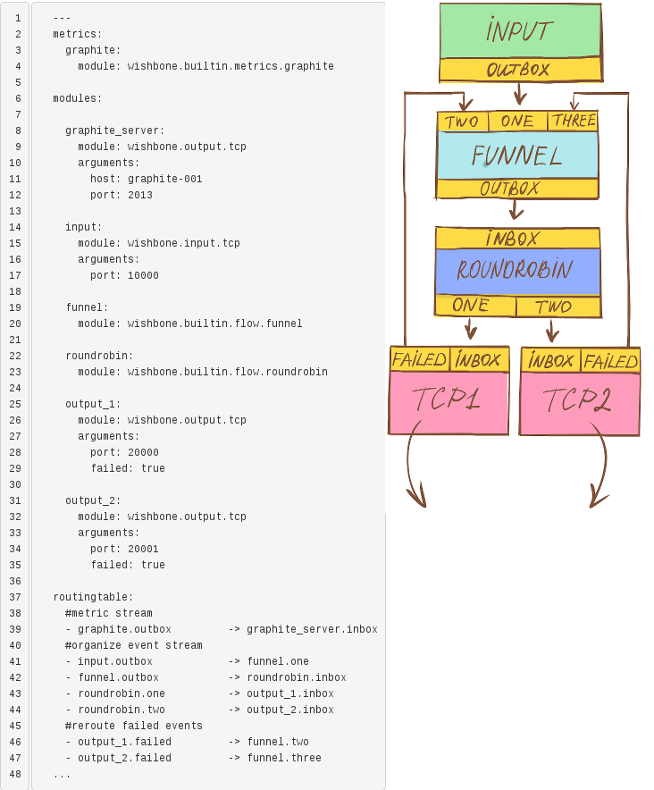
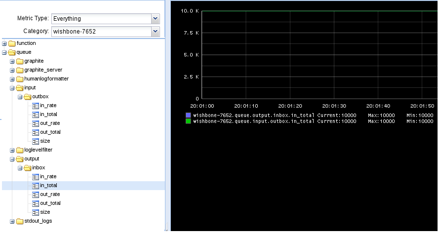
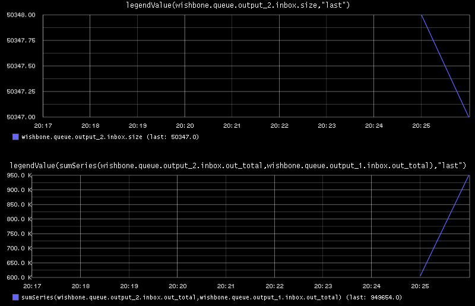

Load balance and high availability patterns using Wishbone
##########################################################
:date: 2013-10-20 20:42
:author: smetj
:category: engineering
:tags: messaging, events, wishbone, python
:slug: loadbalance-and-ha-patterns-using-wishbone

In this article I would like to explore the possibilities of creating a TCP
based event proxy which balances events to one or more TCP backends.  For this
we will run through a couple of scenarios in which we highlight different
approaches.

Installation
~~~~~~~~~~~~

For the below mentioned scenarios we need to have 3 components installed:

- `Wishbone`_
- `wb_output_tcp`_
- `wb_input_tcp`_

Wishbone itself can be installed through pypi while the two TCP modules have
to be installed from Github.

When everything is installed correctly you should be able to execute the following:

::

    (python-2.7.5)[smetj@indigo ~]$ wishbone list

You should at least see the two tcp modules.

**The bootstrap files used throughout this article can be downloaded from
Github_.**

Introduction
~~~~~~~~~~~~

The bootstrap files used for the following scenarios can be downloaded from
`here`_.  In order to complete the examples you require a working Wishbone
setup along with the 2 TCP modules and a working installation of `nc`_ and
`pv`_ which both are in general available through your package manager.

The scenarios focus on simplicity over practical use in order to highlight the
different aspects Wishbone offers.

The bootstrap files are configured to make use of Graphite to store Wishbone
specific metrics.  This is particularly handy to have some insight about the
dataflow inside Wishbone.  If you don't wish to make use of this you can omit
the "metrics" part of each bootstrap file.

Each scenario requires a set of servers servers.  The easiest is to create a
new terminal/console for each of them so they run separately from each other
in the foreground.

Scenario I - Simple setup
~~~~~~~~~~~~~~~~~~~~~~~~~

In this first scenario we will create 1000 events and pipe them via Wishbone
to some external TCP service.  Each line is one event.  We want to verify
whether we have received all events we have send.

.. code-block:: identifier
  :linenos: table

    ---
    metrics:
      graphite:
        module: wishbone.builtin.metrics.graphite

    modules:

      graphite_server:
        module: wishbone.output.tcp
        arguments:
          host: graphite-001
          port: 2013

      input:
        module: wishbone.input.tcp
        arguments:
          port: 10000

      output:
        module: wishbone.output.tcp
        arguments:
          port: 20000

    routingtable:
      #metric stream
      - graphite.outbox         -> graphite_server.inbox
      #organize event stream
      - input.outbox            -> output.inbox
    ...

In the first console we start our destination server on port 20000.  In the
bootstrap file we have defined that events will be submitted that port (line
24).  We pipe the input it receives to pv, in order to have some basic metrics
available about incoming data after which we write the incoming data to a file
in order to verify the generated data and received data is equal.

Output console
--------------

..

    $ nc -kl 20000|pv -l > scenario_1.output

Wishbone console
-----------------

In the second console,  In another console we start the wishbone server.

..

    $ wishbone debug --config scenario_1.yaml

Input console
--------------

In the third console we first generate the data file, take the hash from it
and then send it to wishbone on port 10000.

..

    $ for c in $(seq 1 10000);do echo hello ;done > scenario_1.input

We take the hash value of our input file:

..

    | $ sha256sum scenario_1.input
    | 7ad0a3fa03c69b6af08ebbede9e20dad2687b5b46481543733152b2ca661e333

Now we send the content of that file to Wishbone:

..

    $ cat scenario_1.input | nc localhost 10000

Verifying the results
---------------------

In the *output* console we can now stop the server by pressing ctrl+c.  If all
went well, *scenario_1.output* has the same checksum as the input file we have
generated on the *input* console.

If we go take a look to Graphite, we can conclude 10000 events arrived in the
**input** module's **outbox** queue and 10000 events arrived in the **output**
module's **inbox** queue.  This is consistent to the routing table we have
defined.

|scenario_1_graphite|

Conclusion
----------

Nothing fancy, simple and straightforward functionality.

Scenario II - Loadbalance over multiple destinations
~~~~~~~~~~~~~~~~~~~~~~~~~~~~~~~~~~~~~~~~~~~~~~~~~~~~

In this scenario we repeat the setup of scenario I but we will spread the
events over 2 destinations.  For this we need to add the `roundrobin`_ module
and one more output module (line 27).

.. code-block:: identifier
  :linenos: table

    ---
    metrics:
      graphite:
        module: wishbone.builtin.metrics.graphite

    modules:

      graphite_server:
        module: wishbone.output.tcp
        arguments:
          host: graphite-001
          port: 2013

      input:
        module: wishbone.input.tcp
        arguments:
          port: 10000

      roundrobin:
        module: wishbone.builtin.flow.roundrobin

      output_1:
        module: wishbone.output.tcp
        arguments:
          port: 20000

      output_2:
        module: wishbone.output.tcp
        arguments:
          port: 20001

    routingtable:
      #metric stream
      - graphite.outbox         -> graphite_server.inbox
      #organize event stream
      - input.outbox            -> roundrobin.inbox
      - roundrobin.one          -> output_1.inbox
      - roundrobin.two          -> output_2.inbox
    ...

The way events stream from one module to the other is defined in the routing
table (line 32).  By default, the  `roundrobin`_ module has only 1 inbox
queue.  when connecting other queues to the module we can choose whatever name
we assign to these queues (line 37 and 38).

The second external TCP server is going to listen on port 20001 (line 30).
The plan is to split the 10000 events over these 2 TCP servers.

Output console 1
----------------

..

    $ nc -kl 20000|pv -l > scenario_2_1.output

Output console 2
----------------

..

    $ nc -kl 20001|pv -l > scenario_2_2.output

Wishbone console
-----------------

..

    $ wishbone debug --config scenario_2.yaml

Input console
-------------

We create again a file containing 10000 events:

..

    $ for c in $(seq 1 10000);do echo hello ;done > scenario_2.input

We take the hash value of our input file:

..

    | $ sha256sum scenario_2.input
    | 7ad0a3fa03c69b6af08ebbede9e20dad2687b5b46481543733152b2ca661e333

Now we send the content of that file to Wishbone:

..

    $ cat scenario_1.input | nc localhost 10000

Verifying the results
---------------------

The events have been split equally over both destinations:

..

    | $ wc -l scenario_2_1.output scenario_2_2.output
    | 5000 scenario_2_1.output
    | 5000 scenario_2_2.output
    | 10000 total

The combined hash of both files *scenario_2_1.output* and
*scenario_2_2.output* using following command:

..

    | $ cat scenario_2_1.output scenario_2_2.output \|sha256sum
    | 7ad0a3fa03c69b6af08ebbede9e20dad2687b5b46481543733152b2ca661e333  -

Conclusion
----------

Adding additional destinations is just a matter of adding more (output)
modules and connect them appropriately in the routing table to the roundrobin
module.

Scenario III - Loadbalance and failover
~~~~~~~~~~~~~~~~~~~~~~~~~~~~~~~~~~~~~~~

Obviously, everything works out when all destinations are in working order. In
reality this is not always going to be the case. In this scenario we will
explore how Wishbone deals with different types of outages.

destination unavailable when initializing Wishbone
--------------------------------------------------

If you repeat scenario II with only 1 TCP server available, you will notice
that all events will arrive in the destination which is alive.  This behavior
is described in the `Wishbone output module patterns documentation`_.  An
output module's input queue is not accepting any input until it determines it
can write events to the outside world.  The module retries every second to
establish a successful connection.  Once done, the input queue is unlocked and
further data is accepted.  In this situation we don't seem to have a problem.

destination becomes unavailable after initializing Wishbone
-----------------------------------------------------------

If however a destination becomes unavailable after the module is already
accepting data, we might end up in a different situation.

Repeat scenario II but with that difference you interrupt one of both
destinations while data is being transmitted.  After all events are submitted
let's check how many events we have received:

..

    | $ wc -l scenario_3_1.output scenario_3_2.output
    | 647208 scenario_3_1.output
    | 302444 scenario_3_2.output
    | 949652 total

So we come short 50348 messages at this stage. Where are they?

If we have a look in Graphite to the metrics Wishbone has produced we can see
that metric wishbone.queue.output_2.inbox.size has a value of 50347.  These
messages are stuck in Wishbone and are not going anywhere as long as
destination 2 is offline.  What happened is that messages were initially
allowed to come into the *output_2* module until that destination became
unavailable after which the inbox of *output_2* got locked.

|scenario_3_graphite|

If sum up all number we still come short 1 message.  It is safe to presume
this message did arrive in nc but wasn't yet written to disk since we have
interrupted the running server.  Using the metrics Wishbone receives we can
sum the total number of messages which passed the queue
*wishbone.queue.output_1.inbox.out_total* and
*wishbone.queue.output_2.inbox.out_total* which is 949654.  Add to this the
number of messages being stuck output_2 *wishbone.queue.output_2.inbox.size*
then we have 1000001.  From this number we have to deduct 1 because it's
required to pop a message from a queue in order to try to submit it.  That one
message is put back in the module's inbox queue.

At least we have all our messages accounted for, but it's still not a
desirable situation.

The solution
------------

To mitigate this, we can initialize the output modules with a argument which
alters the way it deals with messages which failed to go out.  That behavior
is described in the output module patterns documentation_.

|scenario_3|

Basically, it boils down to this: In this bootstrap file we initiate the
output_2 module by setting the failed argument to true (line 35).  That
creates a *failed* queue in which all failed events arrive.  This failed queue
is in its turn connected (line 46-47) to the funnel module (line 19), which
allows the failed events to flow to a working output.  Since the failing
output's inbox queue is locked for incoming events, it will be drained from
all events.

When repeating our last scenario using this bootstrap file, we have according
to Graphite no queues anymore containing stuck messages.

Conclusion
~~~~~~~~~~

Going through the above scenarios we have seen that Wishbone's module and
queue connectivity is a very flexible approach to design and define
alternative message flows.  The module registration and event flow syntax
facilitates easy modification of existing setups with new functionality.  By
submitting Wishbone metrics into Graphite we have a view on the internal
message flow and allows us to verify and confirm assumptions we make about the
message flow.

.. _Wishbone: https://github.com/smetj/wishbone
.. _Github: https://github.com/smetj/experiments/tree/master/blog/loadbalance-and-ha-patterns-using-wishbone
.. _wb_output_tcp: https://github.com/smetj/wishboneModules/tree/master/wb_output_tcp
.. _wb_input_tcp: https://github.com/smetj/wishboneModules/tree/master/wb_input_tcp
.. _nc: http://nmap.org/ncat
.. _pv: http://www.ivarch.com/programs/pv.shtml
.. _here: https://github.com/smetj/experiments/tree/master/blog/loadbalance-and-ha-patterns-using-wishbone
.. _roundrobin: https://wishbone.readthedocs.org/en/latest/modules.html#roundrobin
.. _Wishbone output module patterns documentation: http://wishbone.readthedocs.org/en/latest/patterns.html#starting-state
.. _documentation: http://wishbone.readthedocs.org/en/latest/patterns.html#handle-failed-and-successful-events

