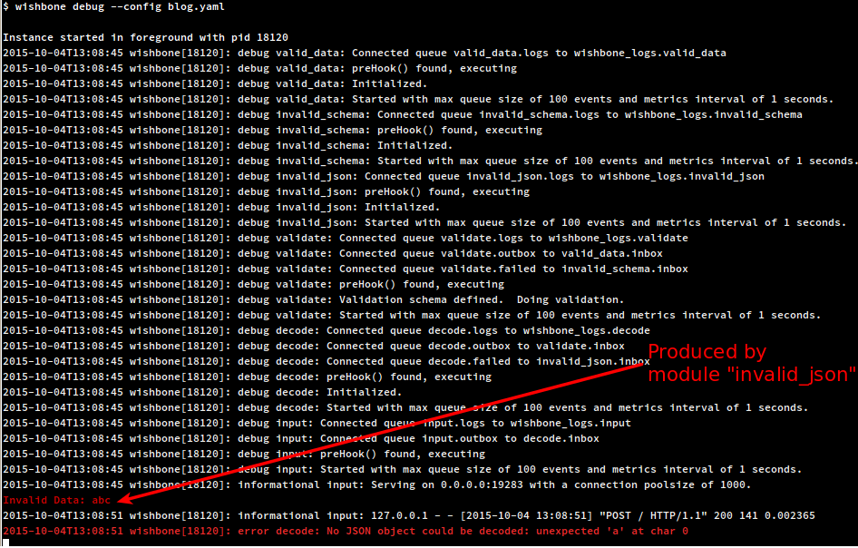
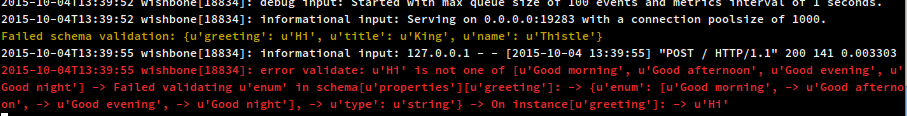
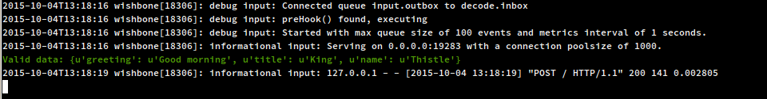

Processing webhook events using Wishbone Part 1: Accept and validate
####################################################################
:date: 2015-10-04 15:00
:author: smetj
:category: technology
:slug: processing_webhooks_using_wishbone_part_1

Many service providers offer `webhooks`_ as a means to integrate their service
into another system.  Webhooks are basically a form of callbacks which can be
used to trigger functionality somewhere else.  In the case of webhooks this is
usually done by submitting some sort structured data like JSON into a http
service. In this article we will cover how you can accept and validate JSON
based webhook events using Wishbone.

Boostrapping a server
---------------------

A Wishbone server is boostrapped using a YAML file.

The bootstrap file we use for this article looks like:

.. code-block:: yaml
  :linenos:

  ---
  modules:
    input:
      module: wishbone.input.httpserver

    decode:
      module: wishbone.decode.json

    validate:
      module: wishbone.function.jsonvalidate
      arguments:
        schema: /tmp/webhook_validation_schema.json

    invalid_json:
      module: wishbone.output.stdout
      arguments:
        prefix: "Invalid Data: "
        foreground_color: RED

    invalid_schema:
      module: wishbone.output.stdout
      arguments:
        prefix: "Failed schema validation: "
        foreground_color: YELLOW

    valid_data:
      module: wishbone.output.stdout
      arguments:
        prefix: "Valid data: "
        foreground_color: GREEN

  routingtable:
    - input.outbox    -> decode.inbox
    - decode.outbox   -> validate.inbox
    - decode.failed   -> invalid_json.inbox
    - validate.outbox -> valid_data.inbox
    - validate.failed -> invalid_schema.inbox
  ...

Starting the server in foreground can be done by issuing:

.. code-block:: sh

  $ wishbone debug --config boostrap.yaml

Receiving data over http(s)
---------------------------

The module responsible for accepting incoming events over HTTP is
*wishbone.input.httpserver*.  The module is initialized on *line 3* and the
instance is called *input*.  The module is initialized using its default
values which is sufficient for this example.  If you would like to see the
available parameters to initialize the module you can do:

.. code-block:: sh

  $ wishbone show --module wishbone.input.httpserver

The module accepts data submitted using a HTTP POST or PUT.  The URL endpoint
determines the module's queue the data will be submitted to.

The **/** endpoint is automatically mapped to the default queue *outbox*.
Endpoints can only have a depth of 1, so *http://localhost:19283/one/two*
would not be a valid URL to which data can be submitted.

When data is be subbmitted to *http://localhost:19283/one* we expect the
module to be connected with a queue named *one* to the queue of some other
module.

The *routingtable* section of the bootstrap file (line 18) determines that the
*input* module has its default queue *outbox* connected to another module
called *decode*.

Decoding JSON
-------------

Internally, Wishbone treats data as a Python data structure, therefor the
incoming data has to be converted to a Python datastructure so downstream
modules can work with it.

More importantly, it also ensures that incoming data is valid JSON.  If that's
not the case, the event is automatically submitted to the module's *failed*
queue from which further action can be taken (line 26) by connecting another
module to it if desired. In this example we print all invalid JSON data to
STDOUT in red (line 12).

Validating JSON data
--------------------

`JSON Schema`_ describes how JSON data must be structured.  In this case we
will use it to validate the client-submitted data.

The JSON schema we will be using as an example is:

.. code-block:: json
  :linenos:

  {
    "type": "object",
    "properties": {
      "greeting": {
        "enum": [
          "Good morning",
          "Good afternoon",
          "Good evening",
          "Good night"
        ],
        "type": "string"
      },
      "name": {
        "type": "string"
      },
      "title": {
        "type": "string"
      }
    },
    "additionalProperties": false,
    "required": [
      "greeting",
      "title",
      "name"
    ]
  }

The validation schema is stored in */tmp/webhook_validation_schema.json* as
defined in our bootstrap file (line 18).

When the incoming JSON data passes the validation it will be submitted to the
module's *outbox* queue.  When the JSON data fails to validate against the
schema it is submitted to the *failed* queue.

In our example validated JSON data will be printed to STDOUT in green (line
33) whilst invalid JSON data will be printed to STDOUT in yellow (line 34).

Running some tests
------------------

Submitting invalid JSON data
~~~~~~~~~~~~~~~~~~~~~~~~~~~~

.. code-block:: sh

  $ echo 'abc'|curl -v -H "Content-type: application/json" -X POST -d @- "http://localhost:19283";echo

Results into following output:

The string 'abc' does not get passed module *decode* and is therefor submitted
via its *failed* queue to the *invalid_json* module which prints incoming data
to STDOUT in red color.

Valid JSON not passing JSON-schema validation
~~~~~~~~~~~~~~~~~~~~~~~~~~~~~~~~~~~~~~~~~~~~~

.. code-block:: sh

  $ echo '{"greeting":"Hi", "title": "King", "name": "Thistle"}'|curl -v -H "Content-type: application/json" -X POST -d @- "http://localhost:19283"

Results into following output:

Although the input is valid JSON, it does not get passed the *validate* module
and is therefor submitted via its *failed* queue to the *invalid_schema*
module which prints incoming data to STDOUT in yellow color.

The schema defines that the allowed values for *"greeting"* may not contain
the value *"Hi"* (line 5).

Valid JSON passing JSON-schema validation
~~~~~~~~~~~~~~~~~~~~~~~~~~~~~~~~~~~~~~~~~

.. code-block:: sh

  $ echo '{"greeting":"Good morning", "title": "King", "name": "Thistle"}'|curl -v -H "Content-type: application/json" -X POST -d @- "http://localhost:19283";echo

Results into following output:

The submitted data is valid JSON and successfully passed the schema validation
and is therefor submitted to the *valid_data* module which prints incoming
data to STDOUT in green color.

Final words
-----------

Although it has its practical use cases like manually validating JSON, this
setup is just an example.  It tries to give the reader an insight on how the
Wishbone system is layed out and how it can be applied to accept and process
JSON data submitted via webhooks.

In a next blogpost we will explore how we can further process the webhook data
with custom code.

.. _webhooks: https://en.wikipedia.org/wiki/Webhook
.. _JSON Schema: http://json-schema.org/
