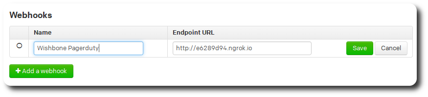

Processing webhooks using Wishbone Part 2: Pagerduty Webhooks
#############################################################
:date: 2016-02-21 10:00
:author: smetj
:category: engineering
:tags: wishbone, webhooks, python
:slug: processing_webhooks_using_wishbone_part_2

__start_summary__

In `a previous article`_ we covered how to accept and validate webhook data
using `Wishbone`_.  In this article we will take things a step further by
processing Pagerduty webhook events and convert them into Nagios external
commands.

__end_summary__

----

Our goal
--------

`Pagerduty`_ is a platform for Enterprise-grade incident management that
helps orchestrate the ideal response to create better customer, employee, and
business value.

In this article we construct a Wishbone `bootstrap file`_ to run an event
pipeline server specifically tailored to convert Pagerduty acknowledgment
events into the corresponding `Nagios external commands`_.

The result is that whenever an incident is acknowledged in Pagerduty, the
corresponding Nagios host or service alert will also become acknowledged
without any user interaction.

----

Prepare connectivity
--------------------

To receive webhooks from Pagerduty, Wishbone has to be accessible from the
internet.  How to achieve that depends on your specific environment and is
beyond the scope of this article.

However, to test Wishbone from the comfort of your laptop you might consider
using `Ngrok`_ to expose `wishbone.input.httpserver`_ to the internet without
much hassle[ref]The `wishbone.input.httpserver`_ module listens by default on
port tcp/19283[/ref]:

.. code-block:: bash

    $ ngrok http 19283

----

Enable Pagerduty webhooks
-------------------------

Pagerduty webhooks are tied to `services`_.

That means every state change of an incident which came into Pagerduty through
that *service* will cause a `webhook event`_ to be submitted to the defined
webhook URL, which in our case will be the Wishbone server.

----

Install Wishbone
----------------

You can install Wishbone by following the instruction `here`_ or by
downloading the `Docker image`_ [ref]If you encounter any problems installing
Wishbone drop me a line so I can help you out and improve the installation
procedure.[/ref]

.. code-block:: bash

    $ docker pull smetj/wishbone:2.1.0

----

Use Wishbone
------------

List available modules
~~~~~~~~~~~~~~~~~~~~~~

You can find a list of all available modules by invoking:

.. code-block:: bash

    $ wishbone list

Get module help
~~~~~~~~~~~~~~~

If you need help about a module to see the parameters it accepts you can
execute:

.. code-block:: bash

    $ wishbone show --module wishbone.input.httpserver

Bootstrap
~~~~~~~~~

.. code-block:: bash

    $ wishbone debug --config bootstrap.yaml

Starts the server in foreground printing all log messages to STDOUT. To stop
the server you can just press CTRL+C.

.. code-block:: bash

    $ docker run -i --volume $(pwd)/boostrap.yaml:/tmp/bootstrap.yaml smetj/wishbone:2.1.0 --config /tmp/bootstrap.yaml

If you're using the Wishbone Docker container you will have to mount the
bootstrap file into the container[ref]Once you have a bootstrap file which
suits your needs you can add it to the container itself.[/ref]

Bootstrap file
--------------

The bootstrap file is Wishbone's configuration.

It defines the pipeline of stages through which the events flow and change
from input to output:

[gist:id=5c8fe017e1e6ae5d0531,file=bootstrap.yaml]

Accepting JSON over HTTP
~~~~~~~~~~~~~~~~~~~~~~~~

To accept the Pagerduty webhook data we use `wishbone.input.httpserver`_ and
assign the instance name *webservice* (line 4) to it.

The *webservice.outbox* queue is then connected to *decode.inbox* (line 68) of
the `wishbone.decode.json`_ module instance (line 8) which converts the JSON
data structure into a Python data structure.  Besides translating the JSON
string into a workable Python datastructure, it also ensures the received data
is valid JSON.

Pagerduty packs multiple events into the `messages array`_.  Since each event
type needs to be treated individually, we extract each entry and create a new
event out of it using `wishbone.function.deserialize`_ prior to sending each
event to the next module (line 70) for further processing.

----

Pattern Matching and event routing
~~~~~~~~~~~~~~~~~~~~~~~~~~~~~~~~~~

`Each Pagerduty event type`_ has to be converted to the corresponding Nagios
external command.  Therefor we need to route the event to right Nagios
conversion module depending on the event type.  Using the `wishbone.flow.jq`_
module we can perform pattern matching and event routing based on `jq
expressions`_

Depending on the event type (line 23, 27) the message is forwarded to the
corresponding queue (line 25, 29). Events which do not match any of the rules
are simply dropped. [ref]You can connect the *no_match* queue to another
module if you wish to treat non matching events differently. See docs of
*wishbone.flow.jq* module for more information.[/ref]

Using this construction all **service** acknowledgments are forwarded to one
module (line 68) whilst **host** acknowledgments are send to another module
(line 71) for further processing. [ref]In my setup the Pagerduty service key
can be either **<hostname>** in case of a *host* alert or
**<hostname/servicedescription>** in case of a service alert, hence the jq
expression validating the content for a "/". (line 24, 28)[/ref]

----

Constructing the Nagios command
~~~~~~~~~~~~~~~~~~~~~~~~~~~~~~~

Now the acknowledgment events are filtered out and split into a *host* and
*service* acknowledgment stream we construct the corresponding Nagios external
commands using a dedicated module for each (line 31, 40).

The Nagios external commands for host and service acknowledgments have
following format:

.. code-block:: text

    [1455750664] ACKNOWLEDGE_HOST_PROBLEM;<host_name>;<sticky>;<notify>;<persistent>;<author>;<comment>
    [1455750664] ACKNOWLEDGE_SVC_PROBLEM;<host_name>;<service_description>;<sticky>;<notify>;<persistent>;<author>;<comment>

The `wishbone.function.modify`_ module offers many ways to manipulate the
content of the event.

In case of a *service* event we're extracting both the *hostname* and
*servicename* out of the incident_key field (line 36) using the **extract**
command[ref]The extract command makes use of *named groups* from Python's re
module. See https://docs.python.org/2/library/re.html [/ref].  The resulting
*dict* containing the extracted key/values is then merged into *@data*.

The next modification (line 37, 45) constructs the epoch timestamp the Nagios
external command require.  This is managed by the **time** command which
converts the event's timestamp into the desired format and stores the result
into a field of choice which is *@data.epoch* in this case.

The last modification (line 38, 46) handles the construction of the actual
data we're going to submit to Nagios itself.  The **template** command accepts
a template and a dictionary to complete the references in the template[ref]The
Python Format Specification Mini-Language
https://docs.python.org/2/library/string.html#format-specification-mini-
language [/ref] storing the result into a field of choice which is
*@tmp.nagios.message* in the above example.

At this point the raw Wishbone event traveling from module to module meanwhile
has following format:

.. code-block:: json

    {
      "@data": {
        "created_on": "2016-01-27T16:54:54Z",
        "data": {
     ...snip...
            "incident_key": "server-123.mycompany.local/Swap Usage",
            "incident_number": 196361,
     ...snip...
        },
        "epoch": "1455835767",
        "hostname": "server-123.mycompany.local",
        "id": "b31a3090-c516-12f5-86f9-22000bffca53",
        "servicename": "Swap Usage",
        "type": "incident.acknowledge"
      },
      "@errors": {},
      "@timestamp": 1455835767.454769,
      "@tmp": {
        "deserialize": {
          "generated_by": true
        },
        "nagios": {
          "message": "[1455835767] ACKNOWLEDGE_SVC_PROBLEM;server-123.mycompany.local;Swap Usage;2;1;1;John Doe;Acknowledged by Wishbone"
        }
      },
      "@version": 1
    }

----

Submitting the Nagios data
~~~~~~~~~~~~~~~~~~~~~~~~~~

Now we have constructed the desired data we have to submit it to its final
destination.

Assuming the Nagios named pipe is made available over TCP we use
`wishbone.output.tcp`_  (line 58) to submit the data to it whilst referring to
*@tmp.nagios.message* (line 64) which contains the relevant data.

Connecting queue *output_funnel.outbox* to queue *output_screen.inbox* instead
prints the Nagios external command to STDOUT, which can be practical to
inspect whether the desired result is achieved.

----

Final words
-----------

In this article we demonstrated how Wishbone can be used to construct a
**middleware** for Pagerduty and Nagios by setting up a sync between two
otherwise disconnected applications.

Obviously, Wishbone is not limited to Pagerduty and Nagios but can be used to
build a bridge between many other systems.  We also have not touched any
advanced topics such as failover, buffer and retry constructions in case of
failure.

The article only covered a small subset of the Pagerduty events though it
should provide enough information on how to proceed extending the bootstrap
file to process other types.

If you find Wishbone useful, have questions of any kind or need my help
implementing a Wishbone server, feel free to get in touch or to add your
comments.

----

Footnotes:

.. _a previous article: http://smetj.net/processing_webhooks_using_wishbone_part_1.html
.. _Wishbone: http://wishbone.readthedocs.org/en/latest
.. _Pagerduty: https://www.pagerduty.com
.. _wishbone module: http://wishbone.readthedocs.org/en/latest/introduction.html#modules-and-queues
.. _bootstrap file:
.. _Docker image: http://wishbone.readthedocs.org/en/latest/installation/docker.html
.. _Ngrok: https://ngrok.com/
.. _webhook event: https://developer.pagerduty.com/documentation/rest/webhooks
.. _webhook data it submits: https://developer.pagerduty.com/documentation/rest/webhooks
.. _wishbone.input.httpserver: http://wishbone.readthedocs.org/en/latest/modules/builtin%20modules.html#wishbone-input-httpserver
.. _wishbone.function.deserialize: http://wishbone.readthedocs.org/en/latest/modules/builtin%20modules.html#wishbone-function-deserialize
.. _wishbone.decode.json: http://wishbone.readthedocs.org/en/latest/modules/builtin%20modules.html#wishbone-decode-json
.. _wishbone.flow.jq: http://wishbone.readthedocs.org/en/latest/modules/builtin%20modules.html#wishbone-flow-jq
.. _wishbone.function.modify: http://wishbone.readthedocs.org/en/latest/modules/builtin%20modules.html#wishbone-function-modify
.. _wishbone.output.file: http://wishbone.readthedocs.org/en/latest/modules/builtin%20modules.html#wishbone-output-file
.. _wishbone.output.tcp: http://wishbone.readthedocs.org/en/latest/modules/builtin%20modules.html#wishbone-output-tcp
.. _Nagios external commands: https://old.nagios.org/developerinfo/externalcommands/commandlist.php
.. _stored in an array:
.. _here: http://wishbone.readthedocs.org/en/latest/installation/index.html
.. _Each Pagerduty event type: https://developer.pagerduty.com/documentation/rest/webhooks
.. _messages array: https://developer.pagerduty.com/documentation/rest/webhooks
.. _jq expressions: https://stedolan.github.io/jq/
.. _command file: https://assets.nagios.com/downloads/nagioscore/docs/nagioscore/3/en/configmain.html#command_file
.. _Livestatus: http://mathias-kettner.com/checkmk_livestatus.html#H1:Sending%20commands%20via%20Livestatus
.. _services: https://support.pagerduty.com/hc/en-us/articles/202828730-Adding-Services

