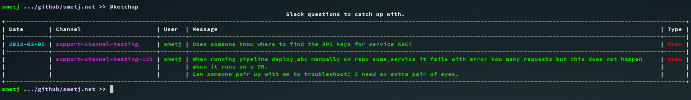

Title: Productivity hacks - Keeping track of user questions on Slack
Date: 2023-03-01 17:00
Modified: 2023-03-01 17:00
category: productivity
Tags: slack
Slug: keeping-track-of-user-questions-on-slack
Authors: Jelle Smet
Summary: Keeping track of user questions on Slack


## Introduction

[Slack](www.slack.com) needs no introduction. Chat in general has found its
way into our daily professional life and its probably here to stay. From the
asynchronous and conversational nature of communication, democratization of
participating in group conversations to organizing conversations per channel.
The advantages are numerous. As you might have guessed it does of course come
with its own unique challenges.

One of those challenges might be to simply keep track of unhandled questions
in a support oriented scenario.

*The [*productivity hacks*](category/productivity.html) series are a series of
short articles exploring helpful techniques to improve your *day-to-day*
productivity.*

## A support oriented challenge

Consider following scenario:

A team of engineers owns a number of services used internally within a
company. It's not unimaginable this team will end up having to give some form
of support to internal users for said services. A common pattern is to create
a dedicated Slack channel per service. Such a channel keeps the topic on point
and facilitates asking for support to the right people such as the
aforementioned engineering team.

### Challenges

Many services, means many channels. If there are many users with a lot of
questions then things start to become an unpleasant *whack-a-mole* game pretty
fast. The result is that colleagues reaching out for help are left behind,
which isn't a great experience. This impacts your MTTR (Mean Time To Respond).
The engineers accidentally overlooking a request are frowned upon.

There are many reasons which amplify this problem. On one side fatigue of
having to continuously scan all the necessary channels and to some extend also
the [bystander effect](https://en.wikipedia.org/wiki/Bystander_effect).

### Solutions

!!! note "ᕙ(`▽´)ᕗ"
    This article doesn't cover preventive steps to curb the amount of user
    questions in the first place. Depending on the nature of the most frequent
    support questions, it might be that providing better documentation or
    offer self-service automation API's will take you a long way.

The problem breaks down into following challenges:

- How to extract user questions from all the other "noise" in the channels?
- How to list all user questions in one overview?
- How to quickly jump from this overview to the actual Slack thread?
- How to exclude the support questions which are handled?

These are 4 questions can be pretty much solved with technology without having
to change much about process.

## Ketchup

[Ketchup](https://github.com/smetj/ketchup) is a CLI tool which aims to solve
the aforementioned challenges.

Consider following configuration file:

```yaml
- name: Demo
  enable: true
  channels:
    - support-channel-testing
    - support-channel-testing-123
  days_back: 7
  done_marker: ':done:'
  field: $.text
  ignore_users:
    - a_colleague_from_my_team_1
    - a_colleague_from_my_team_2
    - a_colleague_from_my_team_3
  query: '?'
  regex_substring: null
  regex_filter: \?(\s+|$)
```

Executing `ketchup` you will get an output similar to this:



Clicking on the message in the terminal opens Slack and brings you to that
particular message.

This example configuration has the following properties:

- Multiple named searches are possible. Each result in the overview is marked
  with the `name` value.
- The list of `channels` to collect user questions from.
- Exclude messages marked with the `done_marker` emoji from showing up in the
  next ketchup executions.
- The `field` value defines the value in the JSON response coming from the
  Slack API to display in the overview.
- The `ignore_users` value is a list of users to ignore. A use-case might be
  your own team members.
- The `query` value basically corresponds to a *term* you would query for in
  the Slack search bar. So this value isn't restricted to `field`.
- `regex_substring` can optionally extract a *substring* from `field`. Useful
  for non-human structured messages.
- `regex_filter` further filters messages returned by the Slack API on the
  `field` content. This example requires a `?` at the end of the message or
  which is at least followed by a space.

## Conclusion

This article demonstrates how to use Ketchup as a tool to improve the
experience of keeping track of pending user questions. Ketchup has a low
footprint and requires no real changes to company processes which might be
hard to implement or slow to change otherwise. Ketchup can be used within a
team behind the scenes whilst the Slack user would only notice the
`done_marker` being added to their questions.

This solution surely isn't entirely waterproof. The convention used in the
aforementioned example on what forms a user request to follow up on, is the
mere fact there's a question mark in the message. That's not a water tight
approach. However, one could say that ... if you write down a question, it
should end with a [question
mark](https://en.wikipedia.org/wiki/Question_mark), a convention which is part
of (most of) our languages.

Hopefully you can now catch up with all those user questions. Enjoy!

For comments and feedback feel free to reach out on [twitter](https://twitter.com/smetj).
