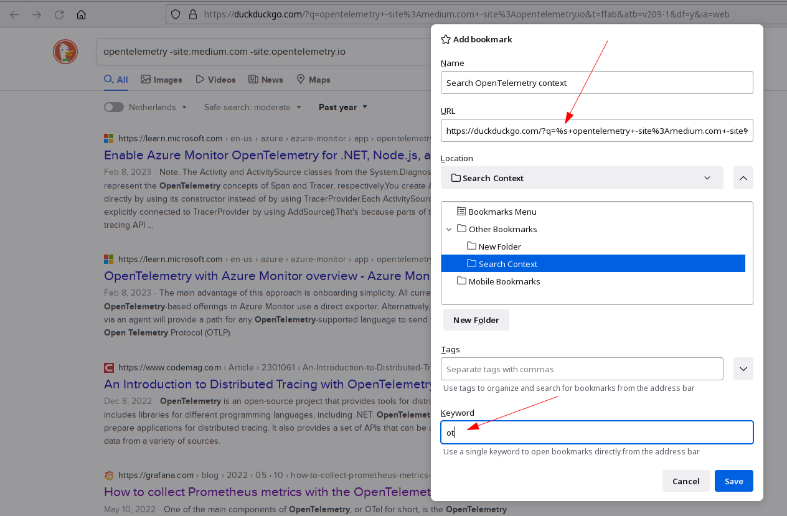

Title: Productivity Hacks - Search results
Date: 2023-02-19 15:00
Modified: 2023-02-19 15:00
category: productivity
Tags: productivity
Slug: productivity-hacks-search-results
Authors: Jelle Smet
Summary: Short articles to describe productivity hacks I


## Introduction

Getting quality search results has become enough of an annoyance to start
looking into ways to improve search. This could mean various things to various
people but some of those annoyances might well be: pay-walled content, domains
using pop-overs or bland Search Engine Optimized (SEO) lure.

This article explores a nice, albeit somewhat obscure, feature in
[Firefox](www.mozilla.org) on the desktop called [bookmark
keywords](https://support.mozilla.org/en-US/kb/bookmarks-firefox#w_how-to-use-keywords-with-bookmarks).

The [*productivity hacks*](category/productivity.html) series are a series of
short articles exploring helpful techniques to improve your *day-to-day*
productivity.

## Duckduckgo and Firefox bookmark keywords

[The DuckDuckGo search
syntax](https://help.duckduckgo.com/duckduckgo-help-pages/results/syntax/)
enables the user to shape and fine-tune queries and their results by adding
filters. One interesting aspect is the ability to exclude certain domains or
keywords from your search results by adding expressions such as `opentelemetry
-site:medium.com -site:opentelemetry.io`. This particular query searches for
the term `opentelemetry` but omits any hits from the `medium.com` and
`opentelemetry.io` domains.

### Bookmark keywords

Obviously, it wouldn't be practical having to add those expressions to each
query made. Besides that, depending on the search context, you probably want
to have different combinations at your disposal anyway.

*Firefox* has the ability to store each crafted combination as a bookmark and
assign a keyword to it. Referring to the keyword in your search bar will open
that bookmark, which is kind of neat but not the complete story.

By adding the `%s` placeholder to the URL *Firefox* will inject the words
added by the user after the *keyword*:



For example:
```
ot python
```

Would be automatically expanded into the following query:

```
python opentelemetry -site:medium.com -site:opentelemetry.io
```

## Closing notes

Using this small neat trick we've demonstrated how to define and apply
pre-defined filters to search queries to come to a better search experience.
Enjoy!

For comments and feedback feel free to reach out on [twitter](https://twitter.com/smetj).
