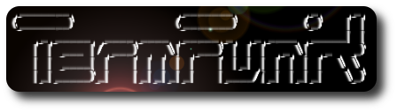

TermFunk: Bridging the gap between Python and the terminal
##########################################################
:date: 2019-01-13 15:00
:author: smetj
:category: technology
:slug: termfunk_bridging_the_gap_between_python_and_the_terminal

.. role:: highlight(code)
   :language: text

|picture|

If you have been a systems engineer or sysadmin for some time you have
probably written and gathered a collection of `shell scripts`_ to solve your
day to day chores. Shell is a powerful language but (arguably) it's syntax is
arcane and scripts can become hard to read and maintain once they grow in size
and logic.

`TermFunk`_ is a lightweight framework to organize, access and execute Python
code from the terminal. Its aim is to bridge the gap between Python and your
terminal by removing all the necessary boilerplate to access functions and
their arguments using auto-completion.

In this article we will create a CLI tool to validate JSON and YAML files
using Python and TermFunk.

Prerequisites
-------------

- TermFunk is fully supported when running Bash. You can use TermFunk with
  other shells but you will probably miss out on most of the auto-completion
  functionality. (help welcome here!)

- Basic Python knowledge.

Installation
------------

To install TermFunk:

.. code-block:: text

    $ pip install TermFunk

Writing your code
------------------

Installing the TermFunk library won't do much on its own. You will have to
create a *class* containing your custom code, which bases the
:highlight:`TermFunk` library:

[gist:id=f1f48fed39fcb68e75c87839953dfd48,file=validate]

- Each class method starting with :highlight:`function_` is considered to be a
  sub-command of your script. (line 12, 18)
- Parameters are automatically mapped to CLI parameters with auto-completion.
  TermFunk comes with multiple types see https://github.com/smetj/termfunk for
  more types.

Preparing you bash environment
------------------------------

For auto-completion to work add a variation of the below code to your
:highlight:`.bashrc` file:

.. code-block:: text

    alias validate=/usr/bin/python3 /home/user/python/scripts/validate.py
    eval "$(validate complete)"

CLI usage
---------

Each part of the command can be auto-completed:

.. code-block:: text

    $ validate json --file some_file.json

A help page containing all valid subcommands (methods) including can be
generated:

.. code-block:: text

    $ validate --help
    usage: validate [-h] {complete,json,yaml} ...

    A collection of validation functions.

    positional arguments:
      {complete,json,yaml}

    optional arguments:
      -h, --help            show this help message and exit

Each sub command has its own help page showing all valid parameters and their
type:

.. code-block:: text

    $ validate json --help
    usage: validate json [-h] [--file FILE]

    optional arguments:
      -h, --help   show this help message and exit
      --file FILE  : <File>

Final words
-----------

`TermFunk`_ can be useful to expose your Python code to the terminal and
making it accessible without having to write much boilerplate code.  If you
find *TermFunk* useful or have any questions or suggestions don't hesite to
get in touch.

.. _TermFunk: https://github.com/smetj/TermFunk
.. _shell scripts: https://en.wikipedia.org/wiki/Shell_script

