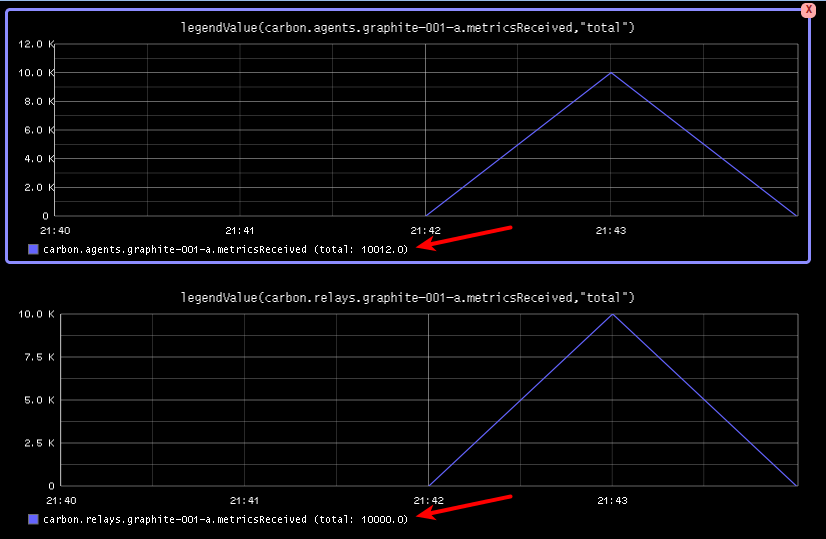
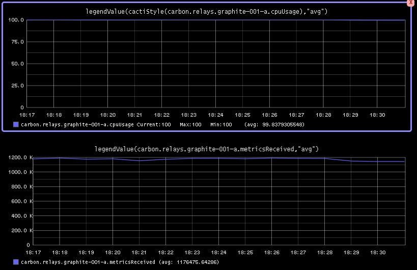

Testing Graphite with MetricFactory revisited
#############################################
:date: 2013-10-20 20:42
:author: smetj
:category: #monitoringlove
:tags: monitoringlove, graphite, metricfactory, python
:slug: testing-graphite-with-metricfactory-revisited

In this post we revisit a previously posted article on how we can test and
stress test a Graphite setup. This is basically a rewrite of that article
since the Wishbone and MetricFactory software have meanwhile changed
enough to dedicate a new article to it.

Our end-goal still stands.  We want to test and understand the behavior of a
Graphite setup by writing metrics into it using different scenarios.

Installation
~~~~~~~~~~~~

Installing metricfactory is a matter of checking out the project from
Git and running the installer.  All dependencies should be downloaded
automatically.

::

  $ git clone https://github.com/smetj/metricfactory
  $ cd metricfactory
  $ sudo python setup.py install

An additional `Wishbone module`_:

- https://github.com/smetj/wishboneModules/tree/master/wb_output_tcp

::

  $ git clone https://github.com/smetj/wishboneModules
  $ cd wishboneModules/wb_output_tcp/
  $ sudo python setup.py install

One or more of following packages might be required to successfully
finish the install:

  gcc, gcc-c++, make, python-devel, Cython

Once installed you can execute following command:

::

    $ metricfactory list
    $ metricfactory list --group metricfactory.encoder
    $ metricfactory list --group metricfactory.decoder
    $ metricfactory list --group metricfactory.test

That should return a list of all available modules.  You should see at
least tcp, hammer and graphite.

Bootstrap
~~~~~~~~~

Starting Metricfactory requires a bootstrap file.  A bootstrap file is a YAML
formatted file containing the configuration of which modules to initiate and
which path events will follow through these module instances.

All bootstrap files used throughout this article can be found `here`_.

Scenario 1: Submit fixed number of metrics to graphite.
~~~~~~~~~~~~~~~~~~~~~~~~~~~~~~~~~~~~~~~~~~~~~~~~~~~~~~~

Let's say we have a Graphite setup of 1 carbon-relay instance which forwards
metrics to 1 or more carbon instances.  We want to see how Graphite behaves
under a predictable load.

.. code-block:: identifier
  :linenos: inline

  ---
  modules:

      hammer:
          module: metricfactory.test.hammer
          arguments:
              batch: 1
              batch_size: 100
              set_size: 100
              value: 1000

      encodegraphite:
          module: wishbone.builtin.metrics.graphite

      tcp:
          module: wishbone.output.tcp
          arguments:
              host: graphite-001
              port: 2013

  routingtable:

      - hammer.outbox             -> encodegraphite.inbox
      - encodegraphite.outbox     -> tcp.inbox
  ...

The hammer module (line 4) is the module which generates metrics in a generic
format. The module is initialized to produce 1 batch (line 7) of metrics
consisting out of 100 unique sets (line 8) each containing 100 metrics
(line9). This means 10000 unique metrics are generated. Batch (line 7)
determines how many times we want to regenerate this collection of metrics.  A
value of 0 would mean indefinitely.  The sleep parameter (not used, default 1)
determines the time in seconds between each batch. The value parameter (line
10) determines the maximum value the random generated metric value can be.

The routing table (line 21) tells us events are traveling through the modules
in following order:

  hammer -> encodegraphite -> tcp

The tcp module (line 15) submits the metrics over TCP to the destination
defined with the host (line 18) and port (line 19)

Start the server in the foreground using following command:

::

    $ metricfactory debug --config hammer_scenario_1.yaml

You can stop by pressing ctrl+c.

|graphite1|

When reviewing the metricsReceived values of both the carbon.relay as
carbon.cache we see we have received the expected amount of metrics.

Keep in mind since each generated metric is unique, **10000 wsp files** are
created. It's likely that after running this test,  you will only find a
subset of the generated data stored in Graphite.  This is because Graphite
does rate limiting and is not creating all wsp files in order not to hammer
the disks.  You might want to tweak Graphite to meet your expectations and
rerun the above setup to test your setup.

Scenario 2: Submit a fixed number of metrics to 2 carbon-relays
~~~~~~~~~~~~~~~~~~~~~~~~~~~~~~~~~~~~~~~~~~~~~~~~~~~~~~~~~~~~~~~

Let's say we have a setup with 2 carbon relays with multiple carbon-caches
behind that.  In this case you might want to verify whether you can really
afford to loose a relay node.  We can use the same approach as we did in
scenario 1 and produce and submit a known number of metrics.

The below bootstrap file is setup in such a way that produced metrics are
spread over 2 tcp destinations.  You might want to execute a couple of runs
while killing parts of your Graphite setup to verify it behaves as expected
and whether there is no metric loss.

.. code-block:: identifier
  :linenos: inline

  ---
  modules:

      hammer:
          module: metricfactory.test.hammer
          arguments:
              batch: 10
              batch_size: 100
              set_size: 100
              value: 1000
              sleep: 1

      encodegraphite:
          module: wishbone.builtin.metrics.graphite

      funnel:
          module: wishbone.builtin.flow.funnel

      balance:
          module: wishbone.builtin.flow.roundrobin

      tcp1:
          module: wishbone.output.tcp
          arguments:
              host: graphite-001
              port: 2013

      tcp2:
          module: wishbone.output.tcp
          arguments:
              host: graphite-002
              port: 2013

  routingtable:

      - hammer.outbox             -> encodegraphite.inbox
      - encodegraphite.outbox     -> funnel.two

      - funnel.outbox             -> balance.inbox
      - balance.one               -> tcp1.inbox
      - balance.two               -> tcp2.inbox

      - tcp1.failed               -> funnel.one
      - tcp2.failed               -> funnel.three
  ...

Start the server in the foreground using following command:

::

    $ metricfactory debug --config hammer_scenario_2.yaml

You can stop by pressing ctrl+c.

The above example will send 10 batches (line 7) of 100 sets (line 8) of 100
metrics (line 9) resulting into 100000 unique metrics.  Between each batch
10000 metrics we wait 1 second (line 11).

Scenario 3: Determine the maximum throughput of metrics
~~~~~~~~~~~~~~~~~~~~~~~~~~~~~~~~~~~~~~~~~~~~~~~~~~~~~~~

Let's say we want to have a ballpark number of how many metrics per second our
Graphite instance is able to receive.

For this we use the below bootstrap file:

.. code-block:: identifier
  :linenos: inline

  ---
  modules:

      hammer:
          module: metricfactory.test.hammer
          arguments:
              batch: 0
              batch_size: 100
              set_size: 100
              value: 1000

      encodegraphite:
          module: wishbone.builtin.metrics.graphite

      tcp:
          module: wishbone.output.tcp
          arguments:
              host: graphite-001
              port: 2013

  routingtable:

      - hammer.outbox             -> encodegraphite.inbox
      - encodegraphite.outbox     -> tcp.inbox
  ...

By setting the batch argument (line 10) to 0, we indefinitely send the defined
batch.  If we overflow Metricfactory because we can't write metrics out fast
enough , throttling will be enabled automatically.

You could even start X amount of similar parallel processes by using the
--instances parameter when bootstrapping:

::

    $ metricfactory debug --config hammer_scenario_3.yaml --instances 4

|graphite3|

As you can see we're maxing out the cpu usage of the relay server while
processing on average 1117000 metrics/s.

Conclusion
~~~~~~~~~~

Generating a predictable number of metrics can be practical to verify whether
Graphite behaves as expected in different scenarios.  It becomes even more
meaningful when you have a more complex environment with a number of relays
with sharding and duplication policies.  By generating batches of continuous
mertics it's possible to get an idea about the throughput of your Graphite
setup.

.. _Metricfactory: https://github.com/smetj/metricfactory
.. _Wishbone: https://github.com/smetj/wishbone
.. _Wishbone module: https://github.com/smetj/wishboneModules
.. _here: https://github.com/smetj/experiments/blob/master/metricfactory/hammerGraphite
.. _|graphite3|: http://smetj.net/2013/04/28/testing-graphite-with-metricfactory/graphite3/
.. _The difference in Graphite throughput by changing the buffer events variable (line 34) from 100 to 1000.: http://smetj.net/2013/04/28/testing-graphite-with-metricfactory/graphite2/

