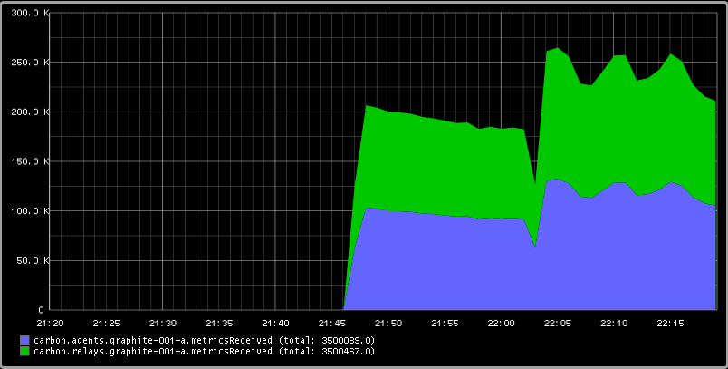

Testing Graphite with MetricFactory revisited
#############################################
:date: 2013-10-09 22:14
:author: smetj
:category: events
:tags: monitoringlove, graphite, metricfactory, python
:slug: testing-graphite-with-metricfactory-revisited

In this post we revisit a previously posted article on how we can test and
stress test a Graphite setup. This is basiscally a rewrite of that article
since the Wishbone and MetricFactory software has meanwhile changed
enough to dedicate a new article to it.

Our end-goal still stands.  We want to test and understand the behavior of a
Graphite setup by writing metrics into it using different scenarios.

Installation
~~~~~~~~~~~~

Installing metricfactory is a matter of checking out the project from
Git and running the installer.  All dependencies should be downloaded
automatically.

::

    $ git clone https://github.com/smetj/metricfactory
    $ cd metricfactory
    $ sudo python setup.py install

We will also require an extra `Wishbone module`_:

- https://github.com/smetj/wishboneModules/tree/master/wb_output_tcp

One or more of following packages might be required to successfully
finish the install:

  gcc, gcc-c++, make, python-devel, Cython

Once installed you can execute following command:

::

    $ wishbone list
    $ wishbone list --group metricfactory.encoder
    $ wishbone list --group metricfactory.decoder
    $ wishbone list --group metricfactory.test

That should return a list of all available modules.  You should see at
least tcp, hammer and graphite.

Bootstrap
~~~~~~~~~

Starting Metricfactory requires a bootstrap file.  A bootstrap file is a YAML
formatted file containing the configuration of which modules to initiate and
which path events will follow through these module instances.

A base bootstrap file you can found `here`_.  We will be adapting it to
suit our needs.  Going through the content it should give you an idea
what the possibilities are.

Scenario 1: Submit fixed number of metrics to graphite.
~~~~~~~~~~~~~~~~~~~~~~~~~~~~~~~~~~~~~~~~~~~~~~~~~~~~~~~

Let's say we have a Graphite setup of 1 carbon-relay instance which forwards
metrics to 1 or more carbon instances.  We want to see how Graphite behaves
under a predictable load.

.. code-block:: identifier
  :linenos: table

  ---
  modules:

      hammer:
          module: metricfactory.test.hammer
          arguments:
              mode: sequential
              total: 0
              sleep: 0
              host: 100
              metric: 100
              value: 10000000

      encodegraphite:
          module: metricfactory.encoder.graphite
          arguments:
              prefix: hammer

      tcp:
          module: wishbone.output.tcp
          arguments:
              host: graphite-001
              port: 2013

  routingtable:

      - hammer.outbox             -> encodegraphite.inbox
      - encodegraphite.outbox     -> tcp.inbox
  ...

The hammer module (line 4) is the module which actually generates the metrics.
We initialize the module in random mode (line 7).  That means each individual
metric is unique in terms of *hostname.metricname*.  The amount of metrics to
generate is determined by the host (line 10) and metric (line 11) variables.
This means we're generating 100 unique metrics for 100 different nodes
resulting into a total of 10000 metrics.

The routing table (line 25) tells us events are travelling through the modules
in following order:

  hammer -> encodegraphite -> tcpout

The tcpout module (line 19) submits the metrics over TCP to the destination
defined with the host (line 22) and port (line 23)

Start the server in the foreground using following command:

::

    $ wishbone debug --config hammer.yaml

You can stop by pressing ctrl+c.

|graphite1|

When reviewing the metricsReceived values of both the carbon.relay as
carbon.cache we see we have received the expected amount of metrics.

Keep in mind that since each generated metric is unique, **10000 wsp files**
are created. It's likely that after running this test,  you will only find a
subset of the generated data stored in Graphite.  This is because Graphite
does rate limiting and is not creating all wsp files in order not to hammer
the disks.  You might want to tweak Graphite to meet your expectactions and
rerun the above setup to test your setup.

Scenario 2: Submit a fixed number of metrics to 2 carbon-relays
~~~~~~~~~~~~~~~~~~~~~~~~~~~~~~~~~~~~~~~~~~~~~~~~~~~~~~~~~~~~~~~

Let's say we have a setup with 2 carbon relays.
You might want to limit the number of connections by grouping metrics
and submit them in bulk to carbon-relay.  We have already initialized
the buffer module (line 30).  The only thing left compared to our
previous scenario is to include the buffer module in our *routingtable*
section (line 48-49).

::

  ---
  modules:

      hammer:
          module: metricfactory.test.hammer
          arguments:
              mode: sequential
              total: 0
              sleep: 0
              host: 100
              metric: 100
              value: 10000

      encodegraphite:
          module: metricfactory.encoder.graphite
          arguments:
              prefix: hammer

      funnel:
          module: wishbone.builtin.flow.funnel

      balance:
          module: wishbone.builtin.flow.roundrobin

      tcp1:
          module: wishbone.output.tcp
          arguments:
              host: graphite-001
              port: 2013

      tcp2:
          module: wishbone.output.tcp
          arguments:
              host: graphite-002
              port: 2013

  routingtable:

      - hammer.outbox             -> encodegraphite.inbox
      - encodegraphite.outbox     -> funnel.two

      - funnel.outbox             -> balance.inbox
      - balance.one               -> tcp1.inbox
      - balance.two               -> tcp2.inbox

      - tcp1.failed               -> funnel.one
      - tcp2.failed               -> funnel.three
  ...

The events variable (line 34) makes the buffer flush when 100 events are
available.  The age variable (line 35) make the buffer flush when the
last added metric added is X seconds old.  With this scenario we would
only require 10 TCP connections compared to 10000 to submit the same
number of metrics.

Scenario 3: Generate a constant stream of random metrics.
~~~~~~~~~~~~~~~~~~~~~~~~~~~~~~~~~~~~~~~~~~~~~~~~~~~~~~~~~

To generate a continuous stream of random metrics we can set the *mode*
variable (line 15) to random.  This gives a different meaning to the
host (line 18) and metric (line 19) variables.  They now become for each
metric the maximum value of a random integer to choose from starting
from 0.  Hostnames will have the format *host_1234* and metrics
*metric_1234.*  Depending upon your specific needs, you might want to
choose a higher value to avoid duplicate values being generated.

::

    {
      "metrics": {
        "enable": true,
        "group": "wishbone.metrics",
        "interval": 60,
        "module": "Log",
        "variables": {
        }
      },
      "bootstrap": {
        "hammer": {
          "group": "metricfactory.test",
          "module": "Hammer",
          "variables": {
            "mode":"random",
            "total":0,
            "sleep":0,
            "host":1000,
            "metric":1000,
            "value":10000000
          }
        },
        "encodegraphite": {
          "group": "metricfactory.encoder",
          "module": "Graphite",
          "variables": {
            "prefix":"hammer"
          }
        },
        "buffer": {
          "group": "wishbone.module",
          "module": "TippingBucket",
          "variables": {
            "events": 100,
            "age": 10
          }
        },
        "tcpout": {
          "group": "wishbone.iomodule",
          "module": "TCPClient",
          "variables": {
            "pool": ["graphite-001:2013"]
          }
        }
      },
      "routingtable": {
        "hammer.inbox": [ "encodegraphite.inbox" ],
        "encodegraphite.outbox": [ "buffer.inbox" ],
        "buffer.outbox": [ "tcpout.inbox" ]
      }
    }

The sleep variable (line 17) determines how much time to wait between
generating each metric. That might be useful when you want to limit CPU
usage or control the interval between metrics. A value of 0 means
Metricfactory will drain your CPU trying to produce as much as possible.
Setting a value of 1 means one metric will be produced every second.
 When you notice Metricfactory gradually consumes all memory available
that means data is produced at a higher rate than you can submit to
Graphite. In that case you might want to raise the events variable (line
34) which allows you to submit larger chunks of data per connection.

|graphite3|

`The difference in Graphite throughput by changing the buffer
events variable (line 34) from 100 to 1000.`_

Depending on your settings Metricfactory can generate a significant
amount of metrics.  You could even raise that by starting multiple
parallel processes:

::

    $ metricfactory debug --config hammer.json --instances 4

This will start 4 parallel processes each executing exactly the same.

Conclusion
~~~~~~~~~~

Generating a predictable number of metrics can be practical to verify whether
your Graphite setup behaves as expected under different scenarios.  It becomes
more meaningful if you have a more complex environment with a number of
relays, sharding and duplication policies.  By generating large batches of
continuous data with different sizing it's possible to get an idea about the
throughput of your Graphite setup.

.. _Metricfactory: https://github.com/smetj/metricfactory
.. _Wishbone: https://github.com/smetj/wishbone
.. _Wishbone module: https://github.com/smetj/wishboneModules
.. _here: https://github.com/smetj/experiments/blob/master/metricfactory/hammerGraphite
.. _|graphite3|: http://smetj.net/2013/04/28/testing-graphite-with-metricfactory/graphite3/
.. _The difference in Graphite throughput by changing the buffer events variable (line 34) from 100 to 1000.: http://smetj.net/2013/04/28/testing-graphite-with-metricfactory/graphite2/

.. |graphite1| image:: pics/testing-graphite-with-metricfactory-revisited-001.png
   :target: pics/testing-graphite-with-metricfactory-revisited-001.png

