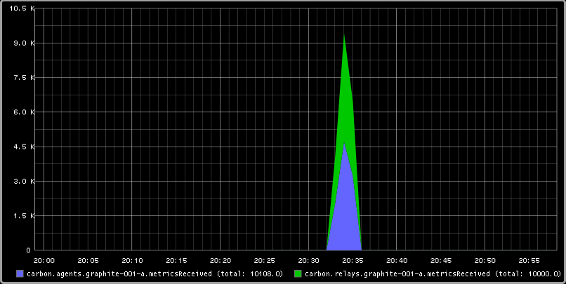

Testing Graphite with MetricFactory
###################################
:date: 2013-04-28 22:14
:author: smetj
:category: engineering
:tags: monitoringlove, graphite, metricfactory, python
:slug: testing-graphite-with-metricfactory

**This article is superseded**
~~~~~~~~~~~~~~~~~~~~~~~~~~~~~~~
Read `Testing Graphite with MetricFactory revisited <|filename|testing-graphite-with-metricfactory-revisited.rst>`_ instead.

__end_summary__

Graphite is great.  Not only because it's a great piece of software but
also because of the community around it which brings forth all kinds of
metrics goodness.  Although it's pretty straightforward to get Graphite
up and running on one node, it gets a bit more complex to get it up and
running in a clustered/sharded/federated mode.  I found `Jeff
Forcier's Clustering Graphite`_ and `Richard Crowley's Federated
Graphite`_ to be very helpful.  Once you have your clustered Graphite
setup up and running you might want to test its behavior and get
acquainted with its different settings and modules before going to
production.  That's where `Metricfactory`_ might help you out.

Metricfactory is a modular framework based on `Wishbone`_ aimed to
quickly assemble servers which process metrics in one way or the other.
 So why not use it to generate random metrics and write them to Graphite
in a controlled way?  With this article I would like to take you through
a couple of use cases.

Installation
~~~~~~~~~~~~

Installing metricfactory is a matter of checking out the project from
Git and running the installer.  All dependencies should be downloaded
automatically.

::

    $ git clone https://github.com/smetj/metricfactory
    $ cd metricfactory
    $ sudo python setup.py install

We will also require some extra `Wishbone modules`_:

::

    $ sudo easy_install wb_tippingbucket
    $ sudo easy_install wb_tcpclient

One or more of following packages might be required to successfully
finish the install:

  gcc, gcc-c++, make, python-devel, Cython

Once installed you can execute following command:

::

    $ metricfactory list

That should return a list of all available modules.  You should see at
least TCPClient, TippingBucket, Hammer and Graphite.

Bootstrap
~~~~~~~~~

Starting Metricfactory requires a bootstrap file.  A bootstrap file is a
JSON formatted file containing the configuration of which modules to
initiate and which path events will follow through these module
instances.

A base bootstrap file you can found `here`_.  We will be adapting it to
suit our needs.  Going through the content it should give you an idea
what the possibilities are.

Scenario 1: Submit unbuffered unique metrics to carbon-relay.
~~~~~~~~~~~~~~~~~~~~~~~~~~~~~~~~~~~~~~~~~~~~~~~~~~~~~~~~~~~~~

Let's say we have 1 carbon-relay instance running which forwards our
metrics to 1 or more carbon instance.  We want to verify whether all our
metrics actually arrive.  Each metric will be submitted as a separate
TCP connection.  This is quite inefficient, we should bundle metrics and
submit them in bulk but for the sake of testing we'll do so.

::

    {
      "metrics": {
        "enable": true,
        "group": "wishbone.metrics",
        "interval": 60,
        "module": "Log",
        "variables": {
        }
      },
      "bootstrap": {
        "hammer": {
          "group": "metricfactory.test",
          "module": "Hammer",
          "variables": {
            "mode":"sequential",
            "total":0,
            "sleep":0,
            "host":100,
            "metric":100,
            "value":10000000
          }
        },
        "encodegraphite": {
          "group": "metricfactory.encoder",
          "module": "Graphite",
          "variables": {
            "prefix":"hammer"
          }
        },
        "buffer": {
          "group": "wishbone.module",
          "module": "TippingBucket",
          "variables": {
            "events": 100,
            "age": 10
          }
        },
        "tcpout": {
          "group": "wishbone.iomodule",
          "module": "TCPClient",
          "variables": {
            "pool": ["graphite-001:2013"]
          }
        }
      },
      "routingtable": {
        "hammer.inbox": [ "encodegraphite.inbox" ],
        "encodegraphite.outbox": [ "tcpout.inbox" ]
      }
    }

The hammer module (line 11) is the module which actually generates the
metrics.  We initialize the module in sequential mode (line 15).  That
means each individual metric is unique in terms of
*hostname.metricname*.  The amount of metrics to generate is determined
by the host (line 18) and metric (line 19) variables.  This means we're
generating 100 unique metrics for 100 different nodes resulting into a
total of 10000 metrics.

The routing table (line 46) tells us events are traveling through the
modules in following order: hammer -> encodegraphite -> tcpout.  The
tcpout module (line 38) submits the metrics over TCP to the destination
defined with the pool variable (line 42).

The buffer module (line 30) is initialized but not included in our
routing table.  That means it's not processing any metrics for the
moment.  We will come back to that in one of the following scenarios.

Start a metricfactory in the foreground using following command:

::

    $ metricfactory debug --config hammer.json

You can stop metricfactory by pressing CTRL+C.

With this particular setup metricfactory will create 1 TCP connection
per metric.  So it might take a while until all metrics are actually
submitted.  Depending on the available resources your mileage may vary.

|graphite1|

When reviewing the self generated Graphite metrics we can see we
actually have received 10000 metrics.

When you have more than one carbon-relay server you can extend the
pool variable (line 42) accordingly.

Scenario 2: Submit buffered unique metrics to carbon-relay.
~~~~~~~~~~~~~~~~~~~~~~~~~~~~~~~~~~~~~~~~~~~~~~~~~~~~~~~~~~~

You might want to limit the number of connections by grouping metrics
and submit them in bulk to carbon-relay.  We have already initialized
the buffer module (line 30).  The only thing left compared to our
previous scenario is to include the buffer module in our *routingtable*
section (line 48-49).

::

    {
      "metrics": {
        "enable": true,
        "group": "wishbone.metrics",
        "interval": 60,
        "module": "Log",
        "variables": {
        }
      },
      "bootstrap": {
        "hammer": {
          "group": "metricfactory.test",
          "module": "Hammer",
          "variables": {
            "mode":"sequential",
            "total":0,
            "sleep":0,
            "host":100,
            "metric":100,
            "value":10000000
          }
        },
        "encodegraphite": {
          "group": "metricfactory.encoder",
          "module": "Graphite",
          "variables": {
            "prefix":"hammer"
          }
        },
        "buffer": {
          "group": "wishbone.module",
          "module": "TippingBucket",
          "variables": {
            "events": 100,
            "age": 10
          }
        },
        "tcpout": {
          "group": "wishbone.iomodule",
          "module": "TCPClient",
          "variables": {
            "pool": ["graphite-001:2013"]
          }
        }
      },
      "routingtable": {
        "hammer.inbox": [ "encodegraphite.inbox" ],
        "encodegraphite.outbox": [ "buffer.inbox" ],
        "buffer.outbox": [ "tcpout.inbox" ]
      }
    }

The events variable (line 34) makes the buffer flush when 100 events are
available.  The age variable (line 35) make the buffer flush when the
last added metric added is X seconds old.  With this scenario we would
only require 10 TCP connections compared to 10000 to submit the same
number of metrics.

Scenario 3: Generate a constant stream of random metrics.
~~~~~~~~~~~~~~~~~~~~~~~~~~~~~~~~~~~~~~~~~~~~~~~~~~~~~~~~~

To generate a continuous stream of random metrics we can set the *mode*
variable (line 15) to random.  This gives a different meaning to the
host (line 18) and metric (line 19) variables.  They now become for each
metric the maximum value of a random integer to choose from starting
from 0.  Hostnames will have the format *host\_1234* and metrics
*metric\_1234.*  Depending upon your specific needs, you might want to
choose a higher value to avoid duplicate values being generated.

::

    {
      "metrics": {
        "enable": true,
        "group": "wishbone.metrics",
        "interval": 60,
        "module": "Log",
        "variables": {
        }
      },
      "bootstrap": {
        "hammer": {
          "group": "metricfactory.test",
          "module": "Hammer",
          "variables": {
            "mode":"random",
            "total":0,
            "sleep":0,
            "host":1000,
            "metric":1000,
            "value":10000000
          }
        },
        "encodegraphite": {
          "group": "metricfactory.encoder",
          "module": "Graphite",
          "variables": {
            "prefix":"hammer"
          }
        },
        "buffer": {
          "group": "wishbone.module",
          "module": "TippingBucket",
          "variables": {
            "events": 100,
            "age": 10
          }
        },
        "tcpout": {
          "group": "wishbone.iomodule",
          "module": "TCPClient",
          "variables": {
            "pool": ["graphite-001:2013"]
          }
        }
      },
      "routingtable": {
        "hammer.inbox": [ "encodegraphite.inbox" ],
        "encodegraphite.outbox": [ "buffer.inbox" ],
        "buffer.outbox": [ "tcpout.inbox" ]
      }
    }

The sleep variable (line 17) determines how much time to wait between
generating each metric. That might be useful when you want to limit CPU
usage or control the interval between metrics. A value of 0 means
Metricfactory will drain your CPU trying to produce as much as possible.
Setting a value of 1 means one metric will be produced every second.
 When you notice Metricfactory gradually consumes all memory available
that means data is produced at a higher rate than you can submit to
Graphite. In that case you might want to raise the events variable (line
34) which allows you to submit larger chunks of data per connection.

|graphite3|

`The difference in Graphite throughput by changing the buffer
events variable (line 34) from 100 to 1000.`_

Depending on your settings Metricfactory can generate a significant
amount of metrics.  You could even raise that by starting multiple
parallel processes:

::

    $ metricfactory debug --config hammer.json --instances 4

This will start 4 parallel processes each executing exactly the same.

Conclusion
~~~~~~~~~~

Generating a predictable number of metrics can be practical to verify whether
your Graphite setup behaves as expected under different scenarios.  It becomes
more meaningful if you have a more complex environment with a number of
relays, sharding and duplication policies.  By generating large batches of
continuous data with different sizing it's possible to get an idea about the
throughput of your Graphite setup.

.. _Jeff Forcier's Clustering Graphite: http://bitprophet.org/blog/2013/03/07/graphite/
.. _Richard Crowley's Federated Graphite: http://rcrowley.org/articles/federated-graphite.html
.. _Metricfactory: https://github.com/smetj/metricfactory
.. _Wishbone: https://github.com/smetj/wishbone
.. _Wishbone modules: https://github.com/smetj/wishboneModules
.. _here: https://github.com/smetj/experiments/blob/master/metricfactory/hammerGraphite/hammer.json
.. _|graphite3|: http://smetj.net/2013/04/28/testing-graphite-with-metricfactory/graphite3/
.. _The difference in Graphite throughput by changing the buffer events variable (line 34) from 100 to 1000.: http://smetj.net/2013/04/28/testing-graphite-with-metricfactory/graphite2/

.. |graphite3| image:: pics/graphite3.png
